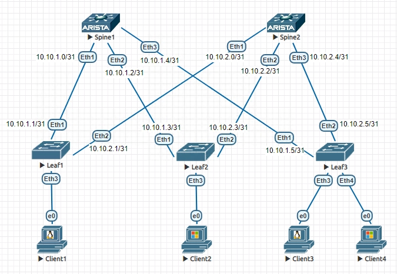

# Проектирование адресного пространства

## Цель:

**Собрать схему CLOS;**

**Распределить адресное пространство;**

## Решение:

**Собираем топологию:**

**Распределяем адресное пространство для Underlay сети:**

**Для p2p каналов между Spine1 и лифами берем подсети**

10.10.1.0/31

10.10.1.2/31

10.10.1.4/31

**Между Spine2 и лифами**

10.10.2.0/31

10.10.2.2/31

10.10.2.4/31

ip адреса на интерфейсах настраиваем командами

Switch(config)#interface Ethernet X

Switch(config-if)#no switchport

Switch(config-if)#ip address _ip-address_ _mask_

