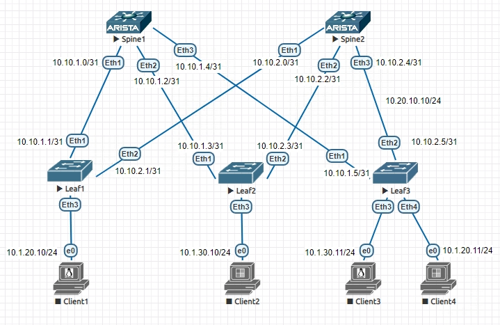
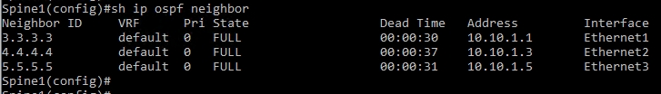
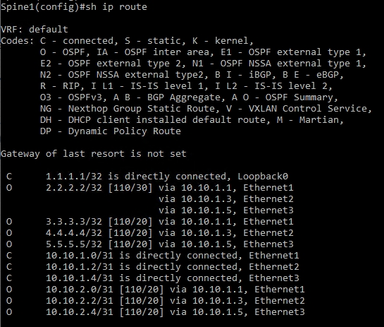
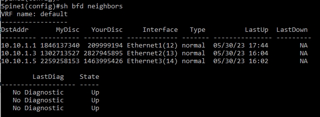

# Underlay. OSPF

## Цель:

**Настроить OSPF для Underlay сети**

## Решение:

**Топология:**

**Адреса p2p каналов:**

|  Узел сети уровня Spine | порт| Адрес Spine    | Узел сети уровня Leaf | порт | Адрес Leaf     | Сеть           |
|---------|---|-------------|-----------|---------|---|----------------|
| Spine1 | Eth1   | 10.10.1.0  | Leaf1 |Eth1    | 10.10.1.1 | 10.10.1.0/31  |
| Spine1 | Eth2   | 10.10.1.2  | Leaf2 |Eth1    | 10.10.1.3 | 10.10.1.2/31  |
| Spine1 | Eth3   | 10.10.1.4  | Leaf3 |Eth1    | 10.10.1.5 | 10.10.1.4/31  |
| Spine2 | Eth1   | 10.10.2.0  | Leaf1 |Eth2    | 10.10.2.1 | 10.10.2.0/31  |
| Spine2 | Eth2   | 10.10.2.2  | Leaf2 |Eth2    | 10.10.2.3 | 10.10.2.2/31  |
| Spine2 | Eth3   | 10.10.2.4  | Leaf3 |Eth2    | 10.10.2.5| 10.10.2.4/31   |

| Свитч  | Адрес Lo0  |   
|--------|------------|
| Spine1 | 1.1.1.1 | 
| Spine2 | 2.2.2.2 | 
| Leaf1  | 3.3.3.3 | 
| Leaf2  | 4.4.4.4 | 
| Leaf3  | 5.5.5.5 |

### **Настройка протокола маршрутизации OSPF**  
**Кроме ip адресов настройки одинаковы для всех свитчей, разберем на примере Spine1:**  

*Включаем маршрутизацию на свитче*

ip routing

*Включаем процесс OSPF*

router ospf 1

*Задаем router-id по ip адресу интерфейса Lo0*

router-id 1.1.1.1

*Включаем OSPF на интерфейсах*

ip ospf area 0.0.0.0

*На физических портах задаем тип линка как point-to-point*

ip ospf network point-to-point

*На физических портах настраиваем аутентификацию*

ip ospf authentication message-digest

ip ospf message-digest-key 1 md5 xxxxxx

**Проверяем, что видим соседей:**

**Проверяем таблицу маршрутизации:**

*Включаем BFD для ускорения обнаружения неисправности линков:*

router ospf 1

bfd all-interfaces

**Проверяем, что bfd видит соседей:**

**Полный конфиг Spine1**

Spine1(config)#sh run

<pre><code>
! Command: show running-config
! device: Spine1 (vEOS, EOS-4.21.1.1F)
!
! boot system flash:/vEOS-lab.swi
!
transceiver qsfp default-mode 4x10G
!
no logging console
!
hostname Spine1
!
spanning-tree mode mstp
!
no aaa root
!
clock timezone Europe/Moscow
!
interface Ethernet1
   mtu 9214
   no switchport
   ip address 10.10.1.0/31
   ip ospf network point-to-point
   ip ospf authentication message-digest
   ip ospf area 0.0.0.0
   ip ospf message-digest-key 1 md5 7 ZKK6ON44AcrshdJc5EPcOA==
!
interface Ethernet2
   mtu 9214
   no switchport
   ip address 10.10.1.2/31
   ip ospf network point-to-point
   ip ospf authentication message-digest
   ip ospf area 0.0.0.0
   ip ospf message-digest-key 1 md5 7 1pyqA/gG7DRN6+O9k+CcSg==
!
interface Ethernet3
   mtu 9214
   no switchport
   ip address 10.10.1.4/31
   ip ospf network point-to-point
   ip ospf authentication message-digest
   ip ospf area 0.0.0.0
   ip ospf message-digest-key 1 md5 7 1pyqA/gG7DRN6+O9k+CcSg==
!
interface Ethernet4
!
interface Ethernet5
!
interface Ethernet6
!
interface Ethernet7
!
interface Ethernet8
!
interface Loopback0
   ip address 1.1.1.1/32
   ip ospf area 0.0.0.0
!
interface Management1
!
ip routing
!
router ospf 1
   router-id 1.1.1.1
   bfd all-interfaces
   max-lsa 12000
!
end
</code></pre>

