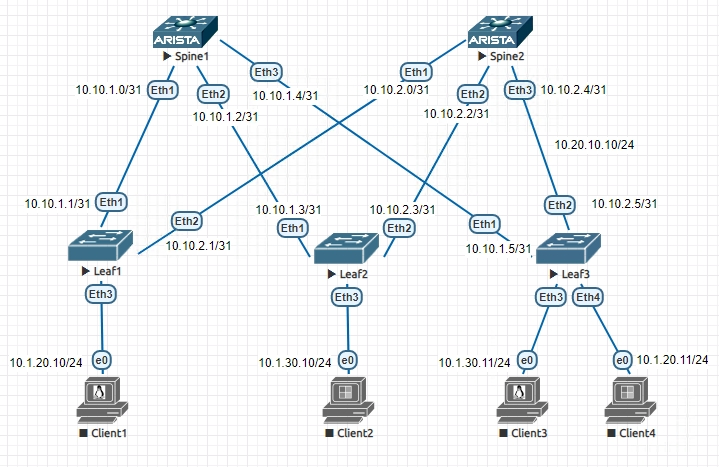
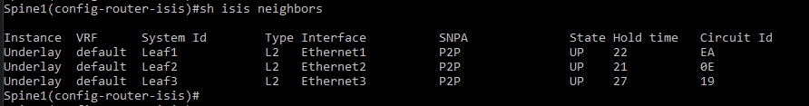
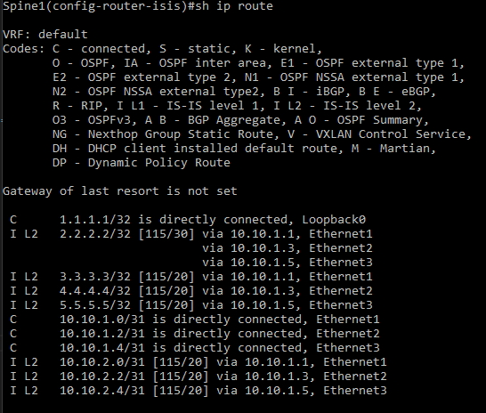
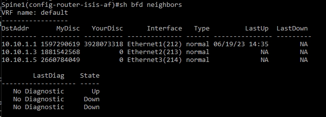

# Underlay. OSPF

## Цель:

**Настроить IS-IS для Underlay сети**

## Решение:

**Топология:**

**Адреса p2p каналов:**

|  Узел сети уровня Spine | порт| Адрес Spine    | Узел сети уровня Leaf | порт | Адрес Leaf     | Сеть           |
|---------|---|-------------|-----------|---------|---|----------------|
| Spine1 | Eth1   | 10.10.1.0  | Leaf1 |Eth1    | 10.10.1.1 | 10.10.1.0/31  |
| Spine1 | Eth2   | 10.10.1.2  | Leaf2 |Eth1    | 10.10.1.3 | 10.10.1.2/31  |
| Spine1 | Eth3   | 10.10.1.4  | Leaf3 |Eth1    | 10.10.1.5 | 10.10.1.4/31  |
| Spine2 | Eth1   | 10.10.2.0  | Leaf1 |Eth2    | 10.10.2.1 | 10.10.2.0/31  |
| Spine2 | Eth2   | 10.10.2.2  | Leaf2 |Eth2    | 10.10.2.3 | 10.10.2.2/31  |
| Spine2 | Eth3   | 10.10.2.4  | Leaf3 |Eth2    | 10.10.2.5| 10.10.2.4/31   |

**Адреса Loopback'ов:**

| Свитч  | Адрес Lo0  |   
|--------|------------|
| Spine1 | 1.1.1.1 | 
| Spine2 | 2.2.2.2 | 
| Leaf1  | 3.3.3.3 | 
| Leaf2  | 4.4.4.4 | 
| Leaf3  | 5.5.5.5 |

### **Настройка протокола маршрутизации ISIS**  
**Кроме ip адресов настройки одинаковы для всех свитчей, разберем на примере Spine1:**  

*Включаем маршрутизацию на свитче*

ip routing

*Включаем процесс ISIS*

router isis Underlay

*Задаем NET на основе адреса Lo0:*

net 49.0001.0010.0100.1001.00

*Задаем тип маршрутизатора, в данном случае везде L2:*

is-type level-2

*Включаем ISIS на интерфейсах:*

isis enable Underlay

*На физических портах задаем тип линка как point-to-point:*

isis network point-to-point

*На физических портах настраиваем аутентификацию:*

isis authentication mode md5

isis authentication key 7 xxxxxx

**Проверяем, что видим соседей:**

**Проверяем таблицу маршрутизации:**

*Включаем BFD для ускорения обнаружения неисправности линков:*

address-family ipv4 unicast

bfd all-interfaces

**Проверяем, что bfd видит соседей:**

**Полный конфиг Spine1**

Spine1(config)#sh run

<pre><code>
! Command: show running-config
! device: Spine1 (vEOS, EOS-4.21.1.1F)
!
! boot system flash:/vEOS-lab.swi
!
transceiver qsfp default-mode 4x10G
!
hostname Spine1
!
spanning-tree mode mstp
!
no aaa root
!
clock timezone Europe/Moscow
!
interface Ethernet1
   no switchport
   ip address 10.10.1.0/31
   isis enable Underlay
   isis bfd
   isis network point-to-point
   isis authentication mode md5
   isis authentication key 7 8OfNRC+zxN2hhJHUspBmYQ==
!
interface Ethernet2
   no switchport
   ip address 10.10.1.2/31
   isis enable Underlay
   isis bfd
   isis network point-to-point
   isis authentication mode md5
   isis authentication key 7 8OfNRC+zxN2hhJHUspBmYQ==
!
interface Ethernet3
   no switchport
   ip address 10.10.1.4/31
   isis enable Underlay
   isis bfd
   isis network point-to-point
   isis authentication mode md5
   isis authentication key 7 8OfNRC+zxN2hhJHUspBmYQ==
!
interface Ethernet4
!
interface Ethernet5
!
interface Ethernet6
!
interface Ethernet7
!
interface Ethernet8
!
interface Loopback0
   ip address 1.1.1.1/32
   isis enable Underlay
!
interface Management1
!
ip routing
!
router isis Underlay
   net 49.0001.0010.0100.1001.00
   is-type level-2
   !
   address-family ipv4 unicast
      bfd all-interfaces
!
end
</code></pre>

**Полный конфиг Spine2**

Spine2(config)#sh run

<pre><code>
! Command: show running-config
! device: Spine2 (vEOS, EOS-4.21.1.1F)
!
! boot system flash:/vEOS-lab.swi
!
transceiver qsfp default-mode 4x10G
!
hostname Spine2
!
spanning-tree mode mstp
!
no aaa root
!
clock timezone Europe/Moscow
!
interface Ethernet1
   no switchport
   ip address 10.10.2.0/31
   isis enable Underlay
   isis bfd
   isis network point-to-point
   isis authentication mode md5
   isis authentication key 7 8OfNRC+zxN2hhJHUspBmYQ==
!
interface Ethernet2
   no switchport
   ip address 10.10.2.2/31
   isis enable Underlay
   isis bfd
   isis network point-to-point
   isis authentication mode md5
   isis authentication key 7 8OfNRC+zxN2hhJHUspBmYQ==
!
interface Ethernet3
   no switchport
   ip address 10.10.2.4/31
   isis enable Underlay
   isis bfd
   isis network point-to-point
   isis authentication mode md5
   isis authentication key 7 8OfNRC+zxN2hhJHUspBmYQ==
!
interface Ethernet4
!
interface Ethernet5
!
interface Ethernet6
!
interface Ethernet7
!
interface Ethernet8
!
interface Loopback0
   ip address 2.2.2.2/32
   isis enable Underlay
!
interface Management1
!
ip routing
!
router isis Underlay
   net 49.0001.0020.0200.2002.00
   is-type level-2
   !
   address-family ipv4 unicast
      bfd all-interfaces
!
end
</code></pre>

**Полный конфиг Leaf1**

Leaf1(config)#sh run

<pre><code>
! Command: show running-config
! device: Leaf1 (vEOS, EOS-4.21.1.1F)
!
! boot system flash:/vEOS-lab.swi
!
transceiver qsfp default-mode 4x10G
!
hostname Leaf1
!
spanning-tree mode mstp
!
no aaa root
!
clock timezone Europe/Moscow
!
interface Ethernet1
   no switchport
   ip address 10.10.1.1/31
   isis enable Underlay
   isis bfd
   isis network point-to-point
   isis authentication mode md5
   isis authentication key 7 8OfNRC+zxN2hhJHUspBmYQ==
!
interface Ethernet2
   no switchport
   ip address 10.10.2.1/31
   isis enable Underlay
   isis bfd
   isis network point-to-point
   isis authentication mode md5
   isis authentication key 7 8OfNRC+zxN2hhJHUspBmYQ==
!
interface Ethernet3
   isis bfd
!
interface Ethernet4
!
interface Ethernet5
!
interface Ethernet6
!
interface Ethernet7
!
interface Ethernet8
!
interface Loopback0
   ip address 3.3.3.3/32
   isis enable Underlay
!
interface Management1
!
ip routing
!
router isis Underlay
   net 49.0001.0030.0300.3003.00
   is-type level-2
   !
   address-family ipv4 unicast
      bfd all-interfaces
!
end
</code></pre>

**Полный конфиг Leaf2**

Leaf2(config)#sh run

<pre><code>
! Command: show running-config
! device: Leaf2 (vEOS, EOS-4.21.1.1F)
!
! boot system flash:/vEOS-lab.swi
!
transceiver qsfp default-mode 4x10G
!
hostname Leaf2
!
spanning-tree mode mstp
!
no aaa root
!
clock timezone Europe/Moscow
!
interface Ethernet1
   no switchport
   ip address 10.10.1.3/31
   isis enable Underlay
   isis bfd
   isis network point-to-point
   isis authentication mode md5
   isis authentication key 7 8OfNRC+zxN2hhJHUspBmYQ==
!
interface Ethernet2
   no switchport
   ip address 10.10.2.3/31
   isis enable Underlay
   isis bfd
   isis network point-to-point
   isis authentication mode md5
   isis authentication key 7 8OfNRC+zxN2hhJHUspBmYQ==
!
interface Ethernet3
!
interface Ethernet4
!
interface Ethernet5
!
interface Ethernet6
!
interface Ethernet7
!
interface Ethernet8
!
interface Loopback0
   ip address 4.4.4.4/32
   isis enable Underlay
!
interface Management1
!
ip routing
!
router isis Underlay
   net 49.0001.0040.0400.4004.00
   is-type level-2
   !
   address-family ipv4 unicast
      bfd all-interfaces
!
end
</code></pre>

**Полный конфиг Leaf3**

Leaf3(config)#sh run

<pre><code>
! Command: show running-config
! device: Leaf3 (vEOS, EOS-4.21.1.1F)
!
! boot system flash:/vEOS-lab.swi
!
transceiver qsfp default-mode 4x10G
!
hostname Leaf3
!
spanning-tree mode mstp
!
no aaa root
!
clock timezone Europe/Moscow
!
interface Ethernet1
   no switchport
   ip address 10.10.1.5/31
   isis enable Underlay
   isis bfd
   isis network point-to-point
   isis authentication mode md5
   isis authentication key 7 8OfNRC+zxN2hhJHUspBmYQ==
!
interface Ethernet2
   no switchport
   ip address 10.10.2.5/31
   isis enable Underlay
   isis bfd
   isis network point-to-point
   isis authentication mode md5
   isis authentication key 7 8OfNRC+zxN2hhJHUspBmYQ==
!
interface Ethernet3
!
interface Ethernet4
!
interface Ethernet5
!
interface Ethernet6
!
interface Ethernet7
!
interface Ethernet8
!
interface Loopback0
   ip address 5.5.5.5/32
   isis enable Underlay
!
interface Management1
!
ip routing
!
router isis Underlay
   net 49.0001.0050.0500.5005.00
   is-type level-2
   !
   address-family ipv4 unicast
      bfd all-interfaces
!
end
</code></pre>

