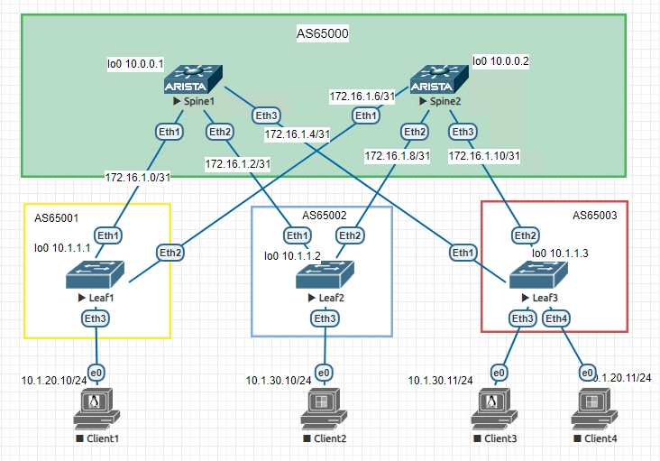
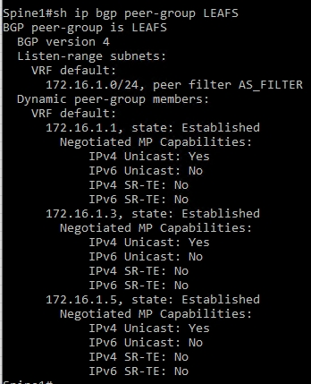
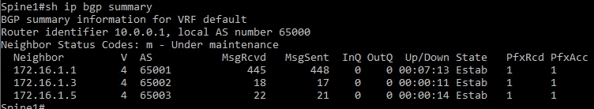
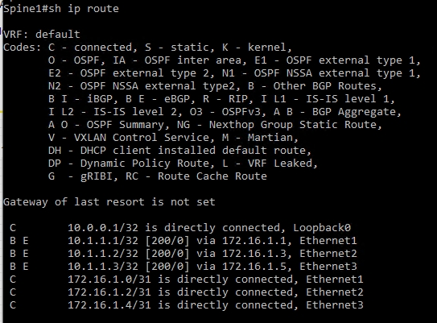
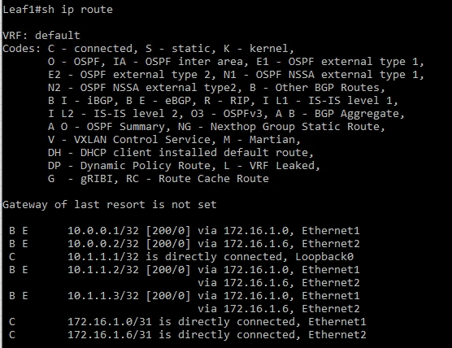
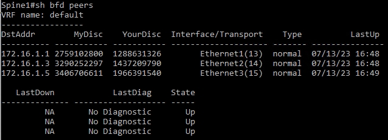

# Underlay. BGP

## Цель:

**Настроить BGP для Underlay сети**

## Решение:

**Топология:**

**Адреса p2p каналов:**

|  Узел сети уровня Spine | порт| Адрес Spine    | Узел сети уровня Leaf | порт | Адрес Leaf     | Сеть           |
|---------|---|-------------|-----------|---------|---|----------------|
| Spine1 | Eth1   | 172.16.1.0  | Leaf1 |Eth1    | 172.16.1.1 | 172.16.1.0/31  |
| Spine1 | Eth2   | 172.16.1.2  | Leaf2 |Eth1    | 172.16.1.3 | 172.16.1.2/31  |
| Spine1 | Eth3   | 172.16.1.4  | Leaf3 |Eth1    | 172.16.1.5 | 172.16.1.4/31  |
| Spine2 | Eth1   | 172.16.1.6  | Leaf1 |Eth2    | 172.16.1.7 | 172.16.1.6/31  |
| Spine2 | Eth2   | 172.16.1.8  | Leaf2 |Eth2    | 172.16.1.9 | 172.16.1.8/31  |
| Spine2 | Eth3   | 172.16.1.10  | Leaf3 |Eth2    | 172.16.1.11| 172.16.1.10/31   |

**Адреса Loopback'ов:**

| Свитч  | Адрес Lo0  |   
|--------|------------|
| Spine1 | 10.0.0.1 | 
| Spine2 | 10.0.0.2 | 
| Leaf1  | 10.1.1.1 | 
| Leaf2  | 10.1.1.2 | 
| Leaf3  | 10.1.1.3 |

### **Настройка протокола маршрутизации BGP**  
**Рассмотрим на примере Spine1 и Leaf1:**  

**Spine1**

*Включаем маршрутизацию на свитче*

ip routing

*Создаем peer filter для последующего динамического обнаружения соседей*

peer-filter AS_FILTER

*Разрешаем AS в которых у нас будут располагаться leaf'ы*

10 match as-range 65001-65999 result accept

*Включаем процесс BGP для AS 65000*

router bgp 65000

*Задаем router-id по ip адресу интерфейса Lo0*

router-id 10.0.0.1

*Разрешаем до 4 маршрутов для каждой подсети*

maximum-paths 4

*Задаем условия для динамического обнаружения соседей, свитчи, находящиеся в подсети 172.16.1.0.24 и в AS заданых ранее фильтром попадают в peer группу LEAFS*

bgp listen range 172.16.1.0/24 peer-group LEAFS peer-filter AS_FILTER

*Устанавливаем соседство со свитчами из группы LEAFS*

neighbor LEAFS peer group

*Включаем для них BFD*

neighbor LEAFS bfd

*Указываем какие подсети будем рассылать соседям, в данном случае только адрес Lo0*

network 10.0.0.1/32

**Leaf1**

*Включаем процесс BGP для AS 65001*

router bgp 65001

*Задаем router-id по ip адресу интерфейса Lo0*

router-id 10.0.0.1

*Разрешаем до 4 маршрутов для каждой подсети*

maximum-paths 4

*На leaf'ах соседей пропишем вручную, создаем peer группу SPINES, свитчи должны быть в AS 65000*

neighbor SPINES peer-group

neighbor SPINES remote-as 65000

*Добавляем в группу Spine1 и Spine2*

neighbor 172.16.1.0 peer group SPINES

neighbor 172.16.1.6 peer group SPINES

*Включаем BFD*

neighbor SPINES bfd

*Импортируем в BGP сеть Lo0*

network 10.1.1.1/32

**Проверяем, что все лифы в группе LEAFS**

**Проверяем, что установилось соседство**

**Проверяем таблицу маршрутизации:**

**Проверяем, что bfd видит соседей:**

**Полный конфиг Spine1**

Spine1(config)#sh run

<pre><code>
! Command: show running-config
! device: Spine1 (vEOS-lab, EOS-4.29.2F)
!
! boot system flash:/vEOS-lab.swi
!
no aaa root
!
transceiver qsfp default-mode 4x10G
!
service routing protocols model ribd
!
hostname Spine1
!
spanning-tree mode mstp
!
clock timezone Europe/Moscow
!
interface Ethernet1
   no switchport
   ip address 172.16.1.0/31
!
interface Ethernet2
   no switchport
   ip address 172.16.1.2/31
!
interface Ethernet3
   no switchport
   ip address 172.16.1.4/31
!
interface Ethernet4
!
interface Ethernet5
!
interface Ethernet6
!
interface Ethernet7
!
interface Ethernet8
!
interface Loopback0
   ip address 10.0.0.1/32
!
</code></pre>

**Полный конфиг Spine2**

Spine2(config)#sh run

<pre><code>
! Command: show running-config
! device: Spine2 (vEOS-lab, EOS-4.29.2F)
!
! boot system flash:/vEOS-lab.swi
!
no aaa root
!
transceiver qsfp default-mode 4x10G
!
service routing protocols model ribd
!
hostname Spine2
!
spanning-tree mode mstp
!
clock timezone Europe/Moscow
!
interface Ethernet1
   no switchport
   ip address 172.16.1.6/31
!
interface Ethernet2
   no switchport
   ip address 172.16.1.8/31
!
interface Ethernet3
   no switchport
   ip address 172.16.1.10/31
!
interface Ethernet4
!
interface Ethernet5
!
interface Ethernet6
!
interface Ethernet7
!
interface Ethernet8
!
interface Loopback0
   ip address 10.0.0.2/32
!
interface Management1
!
ip routing
!
peer-filter AS_FILTER
   10 match as-range 65001-65999 result accept
!
router bgp 65000
   router-id 10.0.0.2
   timers bgp 1 3
   maximum-paths 4
   bgp listen range 172.16.1.0/24 peer-group LEAFS peer-filter AS_FILTER
   neighbor LEAFS peer group
   neighbor LEAFS bfd
   network 10.0.0.2/32
!
end
</code></pre>

**Полный конфиг Leaf1**

Leaf1(config)#sh run

<pre><code>
! Command: show running-config
! device: Leaf1 (vEOS-lab, EOS-4.29.2F)
!
! boot system flash:/vEOS-lab.swi
!
no aaa root
!
transceiver qsfp default-mode 4x10G
!
service routing protocols model ribd
!
hostname Leaf1
!
spanning-tree mode mstp
!
clock timezone Europe/Moscow
!
interface Ethernet1
   no switchport
   ip address 172.16.1.1/31
!
interface Ethernet2
   no switchport
   ip address 172.16.1.7/31
!
interface Ethernet3
!
interface Ethernet4
!
interface Ethernet5
!
interface Ethernet6
!
interface Ethernet7
!
interface Ethernet8
!
interface Loopback0
   ip address 10.1.1.1/32
!
interface Management1
!
ip routing
!
router bgp 65001
   router-id 10.1.1.1
   maximum-paths 4
   neighbor SPINES peer group
   neighbor SPINES remote-as 65000
   neighbor SPINES bfd
   neighbor 172.16.1.0 peer group SPINES
   neighbor 172.16.1.6 peer group SPINES
   network 10.1.1.1/32
!
end
</code></pre>

**Полный конфиг Leaf2**

Leaf2(config)#sh run

<pre><code>
! Command: show running-config
! device: Leaf2 (vEOS-lab, EOS-4.29.2F)
!
! boot system flash:/vEOS-lab.swi
!
no aaa root
!
transceiver qsfp default-mode 4x10G
!
service routing protocols model ribd
!
hostname Leaf2
!
spanning-tree mode mstp
!
clock timezone Europe/Moscow
!
interface Ethernet1
   no switchport
   ip address 172.16.1.3/31
!
interface Ethernet2
   no switchport
   ip address 172.16.1.9/31
!
interface Ethernet3
!
interface Ethernet4
!
interface Ethernet5
!
interface Ethernet6
!
interface Ethernet7
!
interface Ethernet8
!
interface Loopback0
   ip address 10.1.1.2/32
!
interface Management1
!
ip routing
!
router bgp 65002
   router-id 10.1.1.2
   maximum-paths 4
   neighbor SPINES peer group
   neighbor SPINES remote-as 65000
   neighbor SPINES bfd
   neighbor 172.16.1.2 peer group SPINES
   neighbor 172.16.1.8 peer group SPINES
   network 10.1.1.2/32
!
end
</code></pre>

**Полный конфиг Leaf3**

Leaf3(config)#sh run

<pre><code>
! Command: show running-config
! device: Leaf3 (vEOS-lab, EOS-4.29.2F)
!
! boot system flash:/vEOS-lab.swi
!
no aaa root
!
transceiver qsfp default-mode 4x10G
!
service routing protocols model ribd
!
hostname Leaf3
!
spanning-tree mode mstp
!
clock timezone Europe/Moscow
!
interface Ethernet1
   no switchport
   ip address 172.16.1.5/31
!
interface Ethernet2
   no switchport
   ip address 172.16.1.11/31
!
interface Ethernet3
!
interface Ethernet4
!
interface Ethernet5
!
interface Ethernet6
!
interface Ethernet7
!
interface Ethernet8
!
interface Loopback0
   ip address 10.1.1.3/32
!
interface Management1
!
ip routing
!
router bgp 65003
   router-id 10.1.1.3
   maximum-paths 4
   neighbor SPINES peer group
   neighbor SPINES remote-as 65000
   neighbor SPINES bfd
   neighbor 172.16.1.4 peer group SPINES
   neighbor 172.16.1.10 peer group SPINES
   network 10.1.1.3/32
!
end
</code></pre>

