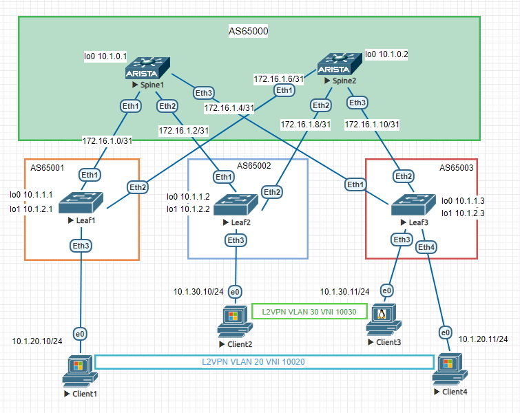
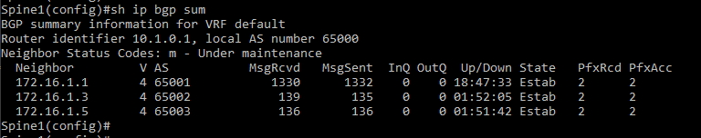
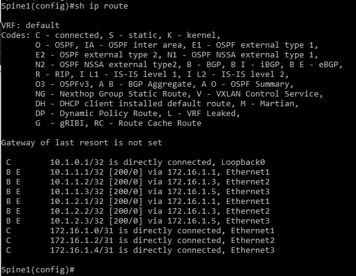
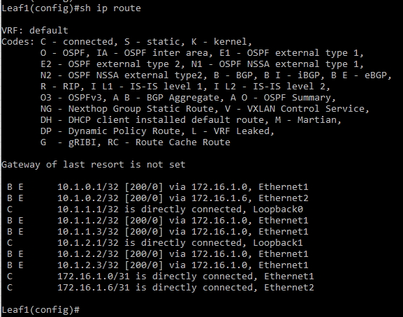
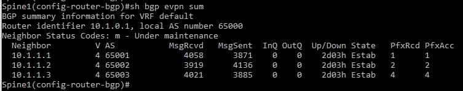
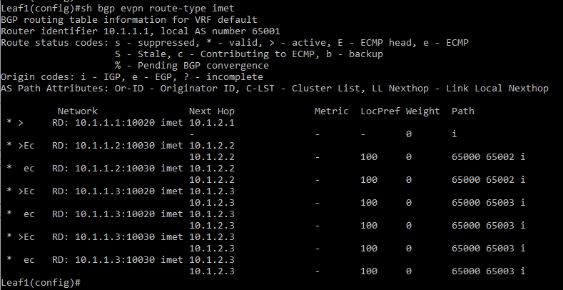
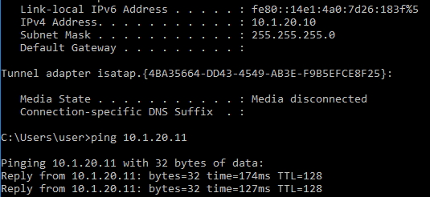
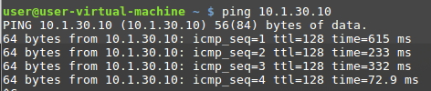

# VxLAN. 1

## Цель:

**Настроить Overlay на основе VxLAN EVPN для L2 связанности между клиентами**

## Решение:

**Топология:**

**Адреса p2p каналов:**

|  Узел сети уровня Spine | порт| Адрес Spine    | Узел сети уровня Leaf | порт | Адрес Leaf     | Сеть           |
|---------|---|-------------|-----------|---------|---|----------------|
| Spine1 | Eth1   | 172.16.1.0  | Leaf1 |Eth1    | 172.16.1.1 | 172.16.1.0/31  |
| Spine1 | Eth2   | 172.16.1.2  | Leaf2 |Eth1    | 172.16.1.3 | 172.16.1.2/31  |
| Spine1 | Eth3   | 172.16.1.4  | Leaf3 |Eth1    | 172.16.1.5 | 172.16.1.4/31  |
| Spine2 | Eth1   | 172.16.1.6  | Leaf1 |Eth2    | 172.16.1.7 | 172.16.1.6/31  |
| Spine2 | Eth2   | 172.16.1.8  | Leaf2 |Eth2    | 172.16.1.9 | 172.16.1.8/31  |
| Spine2 | Eth3   | 172.16.1.10  | Leaf3 |Eth2    | 172.16.1.11| 172.16.1.10/31   |

**Адреса Loopback'ов:**

| Свитч  | Адрес Lo0  | Адрес lo1 | 
|--------|------------|-----------|
| Spine1 | 10.1.0.1 |             |   
| Spine2 | 10.1.0.2 |             | 
| Leaf1  | 10.1.1.1 | 10.1.2.1    | 
| Leaf2  | 10.1.1.2 | 10.1.2.2    |
| Leaf3  | 10.1.1.3 | 10.1.2.3    |

### 1. VLAN-based

### **Настройка протокола маршрутизации BGP для Underlay сети**  
**Рассмотрим на примере Spine1 и Leaf1:**  

**Spine1**

*Включаем маршрутизацию на свитче*

ip routing

*Создаем peer filter для последующего динамического обнаружения соседей*

peer-filter AS_FILTER

*Разрешаем AS в которых у нас будут располагаться leaf'ы*

10 match as-range 65001-65999 result accept

*В prefix list задаем условие под которое подпадают наши loopback'и*

ip prefix-list LOOPBACKS seq 10 permit 10.1.0.0/22 le 32

*Создаем route map для адресов, которые будем рассылать соседям*

route-map LOOPBACKS permit 10

match ip address prefix-list LOOPBACKS

*Включаем процесс BGP для AS 65000*

router bgp 65000

*Задаем router-id по ip адресу интерфейса Lo0*

router-id 10.1.0.1

*Задаем условия для динамического обнаружения соседей, свитчи, находящиеся в подсети 172.16.1.0.24 и в AS заданых ранее фильтром попадают в peer группу LEAFS*

bgp listen range 172.16.1.0/24 peer-group LEAF_UNDERLAY peer-filter AS_FILTER

*Устанавливаем соседство со свитчами из группы LEAFS*

neighbor LEAF_UNDERLAY peer group

*Указываем какие адреса будем рассылать соседям, в данном случае адреса loopback'ов, удовлетворяющие ранее заданому route map*

redistribute connected route-map LOOPBACKS

**Leaf1**

*В prefix list задаем условие под которое подпадают наши loopback'и*

ip prefix-list LOOPBACKS seq 10 permit 10.1.0.0/22 le 32

*Создаем route map для адресов, которые будем рассылать соседям*

route-map LOOPBACKS permit 10

match ip address prefix-list LOOPBACKS

*Включаем процесс BGP для AS 65001*

router bgp 65001

*Задаем router-id по ip адресу интерфейса Lo0*

router-id 10.1.1.1

*На leaf'ах соседей пропишем вручную, создаем peer группу SPINE_UNDERLAY, свитчи должны быть в AS 65000*

neighbor SPINE_UNDERLAY peer group

neighbor SPINE_UNDERLAY remote-as 65000

*Добавляем в группу Spine1 и Spine2*

neighbor 172.16.1.2 peer group SPINE_UNDERLAY

neighbor 172.16.1.8 peer group SPINE_UNDERLAY

*Указываем какие адреса будем рассылать соседям, в данном случае адреса loopback'ов, удовлетворяющие ранее заданому route map*

redistribute connected route-map LOOPBACKS

**Проверяем, что установилось соседство**

**Проверяем таблицу маршрутизации:**

### **Настройка протокола маршрутизации BGP для Overlay сети**  
**Рассмотрим на примере Spine1 и Leaf1:**  

**Spine1**

*Создаем peer группу LEAF_OVERLAY*

neighbor LEAF_OVERLAY peer group

*Настраиваем BGP использовать ip адрес loopback'а в качестве next-hop для EBGP*

neighbor LEAF_OVERLAY update-source Loopback0

*Увеличиваем TTL до 2 чтобы свитчи могли устанавливать пиринг между loopback'ами*

neighbor LEAF_OVERLAY ebgp-multihop 2

*Включаем send-community (включает и standard, и extended) для рассылки route target*

neighbor LEAF_OVERLAY send-community

*Создаем address-family EVPN*

address-family evpn

*Активируем peer-группу LEAF_OVERLAY в address-family EVPN*

neighbor LEAF_OVERLAY activate

**Leaf1**

*Аналогично настраиваем на лифах*

neighbor SPINE_OVERLAY peer group

neighbor SPINE_OVERLAY remote-as 65000

neighbor SPINE_OVERLAY update-source Loopback0

neighbor SPINE_OVERLAY ebgp-multihop 2

neighbor SPINE_OVERLAY send-community

address-family evpn

neighbor SPINE_OVERLAY activate

*В соседях прописываем loopkack'и снайнов*

neighbor 10.1.0.1 peer group SPINE_OVERLAY

neighbor 10.1.0.2 peer group SPINE_OVERLAY

*Создаем vrf'ы для наших vlan'ов*

vlan 20

*Указываем route destinguisher (loopback:vni)*

rd 10.1.1.1:10020

*и route target (ASN:VNI)*

route-target both 1:10020

*Распределяем а этот VRF выученные ip адреса*

redistribute learned

*Создаем связку vlan:vni*

*Создаем туннельный интерефйс Vxlan1*

interface Vxlan1

*В качестве source interface указываем Lo1*

vxlan source-interface Loopback1

*Привязываем vlan к соответствующим vni*

vxlan vlan 20,30 vni 10020,10030

*Провереям что установилось соседство в EVPN*

*Проверяем что клиенты в одном VLAN видят друг друга*

*Client1 - Client4*

*Client2 - Client3*

Полный конфиг Spine1

<pre><code>
! Command: show running-config
! device: Spine1 (vEOS-lab, EOS-4.26.4M)
!
! boot system flash:/vEOS-lab.swi
!
no aaa root
!
transceiver qsfp default-mode 4x10G
!
service routing protocols model multi-agent
!
hostname Spine1
!
spanning-tree mode mstp
!
clock timezone Europe/Moscow
!
interface Ethernet1
   no switchport
   ip address 172.16.1.0/31
!
interface Ethernet2
   no switchport
   ip address 172.16.1.2/31
!
interface Ethernet3
   no switchport
   ip address 172.16.1.4/31
!
interface Ethernet4
!
interface Ethernet5
!
interface Ethernet6
!
interface Ethernet7
!
interface Ethernet8
!
interface Loopback0
   ip address 10.1.0.1/32
!
interface Management1
!
ip routing
!
ip prefix-list LOOPBACKS seq 10 permit 10.1.0.0/22 le 32
!
mpls ip
!
route-map LOOPBACKS permit 10
   match ip address prefix-list LOOPBACKS
!
peer-filter AS_FILTER
   10 match as-range 65001-65999 result accept
!
router bgp 65000
   router-id 10.1.0.1
   bgp listen range 10.1.0.0/22 peer-group LEAF_OVERLAY peer-filter LEAF_AS_RANGE
   bgp listen range 172.16.1.0/24 peer-group LEAF_UNDERLAY peer-filter AS_FILTER
   neighbor LEAF_OVERLAY peer group
   neighbor LEAF_OVERLAY update-source Loopback0
   neighbor LEAF_OVERLAY ebgp-multihop 2
   neighbor LEAF_OVERLAY send-community
   neighbor LEAF_UNDERLAY peer group
   redistribute connected route-map LOOPBACKS
   !
   address-family evpn
      neighbor LEAF_OVERLAY activate
   !
   address-family ipv4
      no neighbor LEAF_OVERLAY activate
!
end
</code></pre>

SПолный конфиг Spine2

<pre><code>
! Command: show running-config
! device: Spine2 (vEOS-lab, EOS-4.26.4M)
!
! boot system flash:/vEOS-lab.swi
!
no aaa root
!
transceiver qsfp default-mode 4x10G
!
service routing protocols model multi-agent
!
hostname Spine2
!
spanning-tree mode mstp
!
clock timezone Europe/Moscow
!
interface Ethernet1
   no switchport
   ip address 172.16.1.6/31
!
interface Ethernet2
   no switchport
   ip address 172.16.1.8/31
!
interface Ethernet3
   no switchport
   ip address 172.16.1.10/31
!
interface Ethernet4
!
interface Ethernet5
!
interface Ethernet6
!
interface Ethernet7
!
interface Ethernet8
!
interface Loopback0
   ip address 10.1.0.2/32
!
interface Management1
!
ip routing
!
ip prefix-list LOOPBACKS seq 10 permit 10.1.0.0/22 le 32
!
mpls ip
!
route-map LOOPBACKS permit 10
   match ip address prefix-list LOOPBACKS
!
peer-filter AS_FILTER
   10 match as-range 65001-65999 result accept
!
router bgp 65000
   router-id 10.1.0.1
   bgp listen range 10.1.0.0/22 peer-group LEAF_OVERLAY peer-filter LEAF_AS_RANGE
   bgp listen range 172.16.1.0/24 peer-group LEAF_UNDERLAY peer-filter AS_FILTER
   neighbor LEAF_OVERLAY peer group
   neighbor LEAF_OVERLAY update-source Loopback0
   neighbor LEAF_OVERLAY ebgp-multihop 2
   neighbor LEAF_OVERLAY send-community
   neighbor LEAF_UNDERLAY peer group
   redistribute connected route-map LOOPBACKS
   !
   address-family evpn
      neighbor LEAF_OVERLAY activate
   !
   address-family ipv4
      no neighbor LEAF_OVERLAY activate
!
end
</code></pre>

Полный конфиг Leaf1

<pre><code>
! Command: show running-config
! device: Leaf1 (vEOS-lab, EOS-4.26.4M)
!
! boot system flash:/vEOS-lab.swi
!
no aaa root
!
transceiver qsfp default-mode 4x10G
!
service routing protocols model multi-agent
!
hostname Leaf1
!
spanning-tree mode mstp
!
clock timezone Europe/Moscow
!
vlan 20
!
interface Ethernet1
   no switchport
   ip address 172.16.1.1/31
!
interface Ethernet2
   no switchport
   ip address 172.16.1.7/31
!
interface Ethernet3
   switchport access vlan 20
!
interface Ethernet4
!
interface Ethernet5
!
interface Ethernet6
!
interface Ethernet7
!
interface Ethernet8
!
interface Loopback0
   ip address 10.1.1.1/32
!
interface Loopback1
   ip address 10.1.2.1/32
!
interface Management1
!
interface Vxlan1
   vxlan source-interface Loopback1
   vxlan udp-port 4789
   vxlan vlan 20 vni 10020
!
ip routing
!
ip prefix-list LOOPBACKS seq 10 permit 10.1.0.0/22 le 32
!
mpls ip
!
route-map LOOPBACKS permit 10
   match ip address prefix-list LOOPBACKS
!
router bgp 65001
   router-id 10.1.1.1
   neighbor SPINE_OVERLAY peer group
   neighbor SPINE_OVERLAY remote-as 65000
   neighbor SPINE_OVERLAY update-source Loopback0
   neighbor SPINE_OVERLAY ebgp-multihop 2
   neighbor SPINE_OVERLAY send-community
   neighbor SPINE_UNDERLAY peer group
   neighbor SPINE_UNDERLAY remote-as 65000
   neighbor 10.1.0.1 peer group SPINE_OVERLAY
   neighbor 10.1.0.2 peer group SPINE_OVERLAY
   neighbor 172.16.1.0 peer group SPINE_UNDERLAY
   neighbor 172.16.1.6 peer group SPINE_UNDERLAY
   redistribute connected route-map LOOPBACKS
   !
   vlan 20
      rd 10.1.1.1:10020
      route-target both 1:10020
      redistribute learned
   !
   address-family evpn
      neighbor SPINE_OVERLAY activate
   !
   address-family ipv4
      no neighbor SPINE_OVERLAY activate
!
end
</code></pre>

Полный конфиг Leaf2

<pre><code>
! Command: show running-config
! device: Leaf2 (vEOS-lab, EOS-4.26.4M)
!
! boot system flash:/vEOS-lab.swi
!
no aaa root
!
transceiver qsfp default-mode 4x10G
!
service routing protocols model multi-agent
!
hostname Leaf2
!
spanning-tree mode mstp
!
clock timezone Europe/Moscow
!
vlan 30
!
interface Ethernet1
   no switchport
   ip address 172.16.1.3/31
!
interface Ethernet2
   no switchport
   ip address 172.16.1.9/31
!
interface Ethernet3
   switchport access vlan 30
!
interface Ethernet4
!
interface Ethernet5
!
interface Ethernet6
!
interface Ethernet7
!
interface Ethernet8
!
interface Loopback0
   ip address 10.1.1.2/32
!
interface Loopback1
   ip address 10.1.2.2/32
!
interface Management1
!
interface Vxlan1
   vxlan source-interface Loopback1
   vxlan udp-port 4789
   vxlan vlan 30 vni 10030
!
ip routing
!
ip prefix-list LOOPBACKS seq 10 permit 10.1.0.0/22 le 32
!
mpls ip
!
route-map LOOPBACKS permit 10
   match ip address prefix-list LOOPBACKS
!
router bgp 65002
   router-id 10.1.1.2
   neighbor SPINE_OVERLAY peer group
   neighbor SPINE_OVERLAY remote-as 65000
   neighbor SPINE_OVERLAY update-source Loopback0
   neighbor SPINE_OVERLAY ebgp-multihop 2
   neighbor SPINE_OVERLAY send-community
   neighbor SPINE_UNDERLAY peer group
   neighbor SPINE_UNDERLAY remote-as 65000
   neighbor 10.1.0.1 peer group SPINE_OVERLAY
   neighbor 10.1.0.2 peer group SPINE_OVERLAY
   neighbor 172.16.1.2 peer group SPINE_UNDERLAY
   neighbor 172.16.1.8 peer group SPINE_UNDERLAY
   redistribute connected route-map LOOPBACKS
   !
   vlan 30
      rd 10.1.1.2:10030
      route-target both 1:10030
      redistribute learned
   !
   address-family evpn
      neighbor SPINE_OVERLAY activate
   !
   address-family ipv4
      no neighbor SPINE_OVERLAY activate
!
end
</code></pre>

Полный конфиг Leaf3

<pre><code>
! Command: show running-config
! device: Leaf3 (vEOS-lab, EOS-4.26.4M)
!
! boot system flash:/vEOS-lab.swi
!
no aaa root
!
transceiver qsfp default-mode 4x10G
!
service routing protocols model multi-agent
!
hostname Leaf3
!
spanning-tree mode mstp
!
clock timezone Europe/Moscow
!
vlan 20,30
!
interface Ethernet1
   no switchport
   ip address 172.16.1.5/31
!
interface Ethernet2
   no switchport
   ip address 172.16.1.11/31
!
interface Ethernet3
   switchport access vlan 30
!
interface Ethernet4
   switchport access vlan 20
!
interface Ethernet5
!
interface Ethernet6
!
interface Ethernet7
!
interface Ethernet8
!
interface Loopback0
   ip address 10.1.1.3/32
!
interface Loopback1
   ip address 10.1.2.3/32
!
interface Management1
!
interface Vxlan1
   vxlan source-interface Loopback1
   vxlan udp-port 4789
   vxlan vlan 20,30 vni 10020,10030
!
ip routing
!
ip prefix-list LOOPBACKS seq 10 permit 10.1.0.0/22 le 32
!
mpls ip
!
route-map LOOPBACKS permit 10
   match ip address prefix-list LOOPBACKS
!
router bgp 65003
   router-id 10.1.1.3
   neighbor SPINE_OVERLAY peer group
   neighbor SPINE_OVERLAY remote-as 65000
   neighbor SPINE_OVERLAY update-source Loopback0
   neighbor SPINE_OVERLAY ebgp-multihop 2
   neighbor SPINE_OVERLAY send-community
   neighbor SPINE_UNDERLAY peer group
   neighbor SPINE_UNDERLAY remote-as 65000
   neighbor 10.1.0.1 peer group SPINE_OVERLAY
   neighbor 10.1.0.2 peer group SPINE_OVERLAY
   neighbor 172.16.1.4 peer group SPINE_UNDERLAY
   neighbor 172.16.1.10 peer group SPINE_UNDERLAY
   redistribute connected route-map LOOPBACKS
   !
   vlan 20
      rd 10.1.1.3:10020
      route-target both 1:10020
      redistribute learned
   !
   vlan 30
      rd 10.1.1.3:10030
      route-target both 1:10030
      redistribute learned
   !
   address-family evpn
      neighbor SPINE_OVERLAY activate
   !
   address-family ipv4
      no neighbor SPINE_OVERLAY activate
!
end
</code></pre>

### 2. VLAN-aware

*Из текущей конфигурации удаляем mac-vrf's*

router bgp 65001

no vlan 20

*Добавляем общий mac-vrf CLIENTS*

vlan-aware-bundle CLIENTS

*добавляем общий RD и RT*

rd 10.1.1.1:10000

route-target both 1:10000

*Перераспределяем выученные маршруты и добавляем в сознаный VFR наши vlan'ы*

redistribute learned

vlan 20

------------------------------

*соответсвие vlan-vni можно сделать с запасом, а потом добавлять новые вланы по мере необходимости:*

interface Vxlan1

vxlan vlan 10-200 vni 10010-10200

