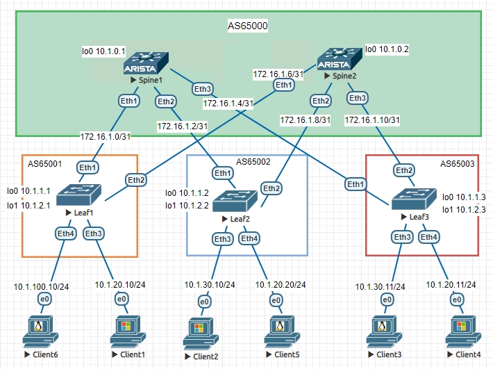
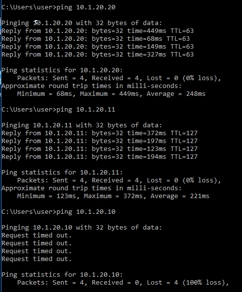
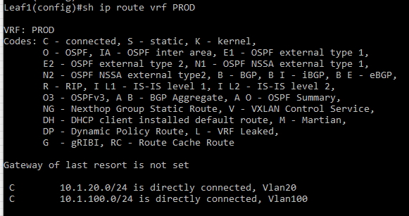
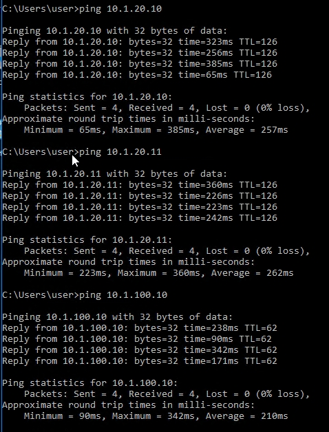
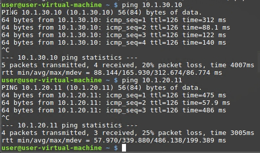
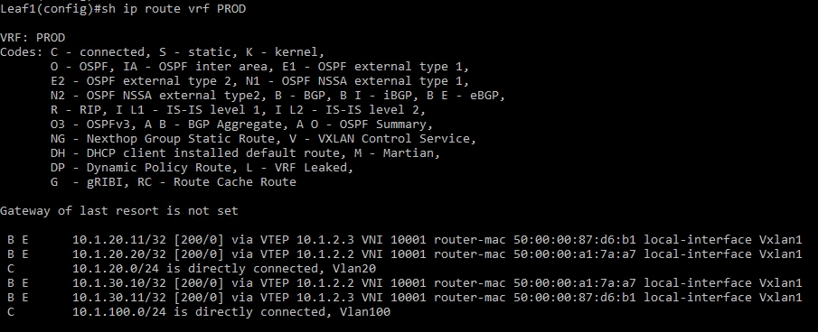

# VxLAN. 1

## Цель:

**Настроить Overlay на основе VxLAN EVPN для L2 связанности между клиентами**

## Решение:

**Топология:**

**Адреса p2p каналов:**

|  Узел сети уровня Spine | порт| Адрес Spine    | Узел сети уровня Leaf | порт | Адрес Leaf     | Сеть           |
|---------|---|-------------|-----------|---------|---|----------------|
| Spine1 | Eth1   | 172.16.1.0  | Leaf1 |Eth1    | 172.16.1.1 | 172.16.1.0/31  |
| Spine1 | Eth2   | 172.16.1.2  | Leaf2 |Eth1    | 172.16.1.3 | 172.16.1.2/31  |
| Spine1 | Eth3   | 172.16.1.4  | Leaf3 |Eth1    | 172.16.1.5 | 172.16.1.4/31  |
| Spine2 | Eth1   | 172.16.1.6  | Leaf1 |Eth2    | 172.16.1.7 | 172.16.1.6/31  |
| Spine2 | Eth2   | 172.16.1.8  | Leaf2 |Eth2    | 172.16.1.9 | 172.16.1.8/31  |
| Spine2 | Eth3   | 172.16.1.10  | Leaf3 |Eth2    | 172.16.1.11| 172.16.1.10/31   |

**Адреса Loopback'ов:**

| Свитч  | Адрес Lo0  | Адрес lo1 | 
|--------|------------|-----------|
| Spine1 | 10.1.0.1 |             |   
| Spine2 | 10.1.0.2 |             | 
| Leaf1  | 10.1.1.1 | 10.1.2.1    | 
| Leaf2  | 10.1.1.2 | 10.1.2.2    |
| Leaf3  | 10.1.1.3 | 10.1.2.3    |

### 0. Настройки Underlay и Overlay оставим как в предыдущей лабораторной (eBGP)

*Увеличим на leaf'ах максимальное количество путей, инсталируемых в таблицу маршрутизации, для балансировки траффика*

maximum-paths 2

### 1. Asymmetric IRB

Настройки spine'ов остаются без изменений.

Настройки на лифах инентичны, разнятся только ip адреса и VLANы, рассмотрим на примере интерфейса для vlan 20 на Leaf1:

*создаем vrf PROD*

vrf instance PROD

*включаем для него роутинг*

ip routing vrf PROD

*создаем VLAN-интерфейс*

interface Vlan20

*добавляем в vrf PROD*

vrf PROD

*задаем виртуальный ip адрес для distributed gateway, он будет одинаков на всех leaf'ах*

ip address virtual 10.1.20.1/24

*создаем виртуальные mac-адрес? так же одинаковый для всех VTEP'ов*

ip virtual-router mac-address 00:00:22:22:33:33

*проверяем что клиенты с разных leaf'ов могут видеть друг друга*

*в представленной конфигурации все клиенты на Leaf2 и Leaf3 будут видеть друг друга*

*Client1 на Leaf1 будет видеть Client6 на том же свитче и клиентов с других свитчей в своем VLAN 20 по L2, так как на Leaf1 нет настроек для VLAN 30*

*Client6 будет видеть только соседа по Leaf1 - Client1, так как настроек для VLAN 100 нет на других свитчах*

**Ping c Client2 (10.1.30.10):**

Asymmetric IRB выполняет маршрутизацию только на входном VTEP, когда пакет перемещается из одного VNI в другой, входной VTEP направляет пакет от исходного VNI к целевому VNI, а выходной VTEP отправляет пакет к хосту назначения внутри целевого VNI на 2 уровне.
Т.о. необходимо настраивать все VLAN'ы и соответствующие им VNI на всех VTEP'ах, о vlan\vni на других лифах VTEP не узнает и общаться с ними не сможет.

**В таблицах маршрутизации vrf PROD лифов видим только connected подсети**

Полный конфиг Spine1

<pre><code>
! Command: show running-config
! device: Spine1 (vEOS-lab, EOS-4.26.4M)
!
! boot system flash:/vEOS-lab.swi
!
no aaa root
!
transceiver qsfp default-mode 4x10G
!
service routing protocols model multi-agent
!
hostname Spine1
!
spanning-tree mode mstp
!
clock timezone Europe/Moscow
!
interface Ethernet1
   no switchport
   ip address 172.16.1.0/31
!
interface Ethernet2
   no switchport
   ip address 172.16.1.2/31
!
interface Ethernet3
   no switchport
   ip address 172.16.1.4/31
!
interface Ethernet4
!
interface Ethernet5
!
interface Ethernet6
!
interface Ethernet7
!
interface Ethernet8
!
interface Loopback0
   ip address 10.1.0.1/32
!
interface Management1
!
ip routing
!
ip prefix-list LOOPBACKS seq 10 permit 10.1.0.0/22 le 32
!
mpls ip
!
route-map LOOPBACKS permit 10
   match ip address prefix-list LOOPBACKS
!
peer-filter AS_FILTER
   10 match as-range 65001-65999 result accept
!
router bgp 65000
   router-id 10.1.0.1
   bgp listen range 10.1.0.0/22 peer-group LEAF_OVERLAY peer-filter LEAF_AS_RANGE
   bgp listen range 172.16.1.0/24 peer-group LEAF_UNDERLAY peer-filter AS_FILTER
   neighbor LEAF_OVERLAY peer group
   neighbor LEAF_OVERLAY update-source Loopback0
   neighbor LEAF_OVERLAY ebgp-multihop 2
   neighbor LEAF_OVERLAY send-community
   neighbor LEAF_UNDERLAY peer group
   redistribute connected route-map LOOPBACKS
   !
   address-family evpn
      neighbor LEAF_OVERLAY activate
   !
   address-family ipv4
      no neighbor LEAF_OVERLAY activate
!
end
</code></pre>

Полный конфиг Spine2

<pre><code>
! Command: show running-config
! device: Spine2 (vEOS-lab, EOS-4.26.4M)
!
! boot system flash:/vEOS-lab.swi
!
no aaa root
!
transceiver qsfp default-mode 4x10G
!
service routing protocols model multi-agent
!
hostname Spine2
!
spanning-tree mode mstp
!
clock timezone Europe/Moscow
!
interface Ethernet1
   no switchport
   ip address 172.16.1.6/31
!
interface Ethernet2
   no switchport
   ip address 172.16.1.8/31
!
interface Ethernet3
   no switchport
   ip address 172.16.1.10/31
!
interface Ethernet4
!
interface Ethernet5
!
interface Ethernet6
!
interface Ethernet7
!
interface Ethernet8
!
interface Loopback0
   ip address 10.1.0.2/32
!
interface Management1
!
ip routing
!
ip prefix-list LOOPBACKS seq 10 permit 10.1.0.0/22 le 32
!
mpls ip
!
route-map LOOPBACKS permit 10
   match ip address prefix-list LOOPBACKS
!
peer-filter AS_FILTER
   10 match as-range 65001-65999 result accept
!
router bgp 65000
   router-id 10.1.0.1
   bgp listen range 10.1.0.0/22 peer-group LEAF_OVERLAY peer-filter LEAF_AS_RANGE
   bgp listen range 172.16.1.0/24 peer-group LEAF_UNDERLAY peer-filter AS_FILTER
   neighbor LEAF_OVERLAY peer group
   neighbor LEAF_OVERLAY update-source Loopback0
   neighbor LEAF_OVERLAY ebgp-multihop 2
   neighbor LEAF_OVERLAY send-community
   neighbor LEAF_UNDERLAY peer group
   redistribute connected route-map LOOPBACKS
   !
   address-family evpn
      neighbor LEAF_OVERLAY activate
   !
   address-family ipv4
      no neighbor LEAF_OVERLAY activate
!
end
</code></pre>

Полный конфиг Leaf1

<pre><code>
! Command: show running-config
! device: Leaf1 (vEOS-lab, EOS-4.26.4M)
!
! boot system flash:/vEOS-lab.swi
!
no aaa root
!
transceiver qsfp default-mode 4x10G
!
service routing protocols model multi-agent
!
hostname Leaf1
!
spanning-tree mode mstp
!
clock timezone Europe/Moscow
!
vlan 20,100
!
vrf instance PROD
!
interface Ethernet1
   no switchport
   ip address 172.16.1.1/31
!
interface Ethernet2
   no switchport
   ip address 172.16.1.7/31
!
interface Ethernet3
   switchport access vlan 20
!
interface Ethernet4
   switchport access vlan 100
!
interface Ethernet5
!
interface Ethernet6
!
interface Ethernet7
!
interface Ethernet8
!
interface Loopback0
   ip address 10.1.1.1/32
!
interface Loopback1
   ip address 10.1.2.1/32
!
interface Management1
!
interface Vlan20
   vrf PROD
   ip address virtual 10.1.20.1/24
!
interface Vlan100
   vrf PROD
   ip address virtual 10.1.100.1/24
!
interface Vxlan1
   vxlan source-interface Loopback1
   vxlan udp-port 4789
   vxlan vlan 20 vni 10020
   vxlan vlan 100 vni 10100
!
ip virtual-router mac-address 00:00:22:22:33:33
!
ip routing
ip routing vrf PROD
!
ip prefix-list LOOPBACKS seq 10 permit 10.1.0.0/22 le 32
!
mpls ip
!
route-map LOOPBACKS permit 10
   match ip address prefix-list LOOPBACKS
!
router bgp 65001
   router-id 10.1.1.1
   maximum-paths 2
   neighbor SPINE_OVERLAY peer group
   neighbor SPINE_OVERLAY remote-as 65000
   neighbor SPINE_OVERLAY update-source Loopback0
   neighbor SPINE_OVERLAY ebgp-multihop 2
   neighbor SPINE_OVERLAY send-community
   neighbor SPINE_UNDERLAY peer group
   neighbor SPINE_UNDERLAY remote-as 65000
   neighbor 10.1.0.1 peer group SPINE_OVERLAY
   neighbor 10.1.0.2 peer group SPINE_OVERLAY
   neighbor 172.16.1.0 peer group SPINE_UNDERLAY
   neighbor 172.16.1.6 peer group SPINE_UNDERLAY
   redistribute connected route-map LOOPBACKS
   !
   vlan 100
      rd 10.1.1.1:10100
      route-target both 1:10100
      redistribute learned
   !
   vlan 20
      rd 10.1.1.1:10020
      route-target both 1:10020
      redistribute learned
   !
   address-family evpn
      neighbor SPINE_OVERLAY activate
   !
   address-family ipv4
      no neighbor SPINE_OVERLAY activate
!
end
</code></pre>

Полный конфиг Leaf2

<pre><code>
! Command: show running-config
! device: Leaf2 (vEOS-lab, EOS-4.26.4M)
!
! boot system flash:/vEOS-lab.swi
!
no aaa root
!
transceiver qsfp default-mode 4x10G
!
service routing protocols model multi-agent
!
hostname Leaf2
!
spanning-tree mode mstp
!
clock timezone Europe/Moscow
!
vlan 20,30
!
vrf instance PROD
!
interface Ethernet1
   no switchport
   ip address 172.16.1.3/31
!
interface Ethernet2
   no switchport
   ip address 172.16.1.9/31
!
interface Ethernet3
   switchport access vlan 30
!
interface Ethernet4
   switchport access vlan 20
!
interface Ethernet5
!
interface Ethernet6
!
interface Ethernet7
!
interface Ethernet8
!
interface Loopback0
   ip address 10.1.1.2/32
!
interface Loopback1
   ip address 10.1.2.2/32
!
interface Management1
!
interface Vlan20
   vrf PROD
   ip address virtual 10.1.20.1/24
!
interface Vlan30
   vrf PROD
   ip address virtual 10.1.30.1/24
!
interface Vxlan1
   vxlan source-interface Loopback1
   vxlan udp-port 4789
   vxlan vlan 20 vni 10020
   vxlan vlan 30 vni 10030
!
ip virtual-router mac-address 00:00:22:22:33:33
!
ip routing
ip routing vrf PROD
!
ip prefix-list LOOPBACKS seq 10 permit 10.1.0.0/22 le 32
!
mpls ip
!
route-map LOOPBACKS permit 10
   match ip address prefix-list LOOPBACKS
!
router bgp 65002
   router-id 10.1.1.2
   maximum-paths 2
   neighbor SPINE_OVERLAY peer group
   neighbor SPINE_OVERLAY remote-as 65000
   neighbor SPINE_OVERLAY update-source Loopback0
   neighbor SPINE_OVERLAY ebgp-multihop 2
   neighbor SPINE_OVERLAY send-community
   neighbor SPINE_UNDERLAY peer group
   neighbor SPINE_UNDERLAY remote-as 65000
   neighbor 10.1.0.1 peer group SPINE_OVERLAY
   neighbor 10.1.0.2 peer group SPINE_OVERLAY
   neighbor 172.16.1.2 peer group SPINE_UNDERLAY
   neighbor 172.16.1.8 peer group SPINE_UNDERLAY
   redistribute connected route-map LOOPBACKS
   !
   vlan 20
      rd 10.1.1.2:10020
      route-target both 1:10020
      redistribute learned
   !
   vlan 30
      rd 10.1.1.2:10030
      route-target both 1:10030
      redistribute learned
   !
   address-family evpn
      neighbor SPINE_OVERLAY activate
   !
   address-family ipv4
      no neighbor SPINE_OVERLAY activate
!
end
</code></pre>

Полный конфиг Leaf3

<pre><code>
! Command: show running-config
! device: Leaf3 (vEOS-lab, EOS-4.26.4M)
!
! boot system flash:/vEOS-lab.swi
!
no aaa root
!
transceiver qsfp default-mode 4x10G
!
service routing protocols model multi-agent
!
hostname Leaf3
!
spanning-tree mode mstp
!
clock timezone Europe/Moscow
!
vlan 20,30
!
vrf instance PROD
!
interface Ethernet1
   no switchport
   ip address 172.16.1.5/31
!
interface Ethernet2
   no switchport
   ip address 172.16.1.11/31
!
interface Ethernet3
   switchport access vlan 30
!
interface Ethernet4
   switchport access vlan 20
!
interface Ethernet5
!
interface Ethernet6
!
interface Ethernet7
!
interface Ethernet8
!
interface Loopback0
   ip address 10.1.1.3/32
!
interface Loopback1
   ip address 10.1.2.3/32
!
interface Management1
!
interface Vlan20
   vrf PROD
   ip address virtual 10.1.20.1/24
!
interface Vlan30
   vrf PROD
   ip address virtual 10.1.30.1/24
!
interface Vxlan1
   vxlan source-interface Loopback1
   vxlan udp-port 4789
   vxlan vlan 20,30 vni 10020,10030
!
ip virtual-router mac-address 00:00:22:22:33:33
!
ip routing
ip routing vrf PROD
!
ip prefix-list LOOPBACKS seq 10 permit 10.1.0.0/22 le 32
!
mpls ip
!
route-map LOOPBACKS permit 10
   match ip address prefix-list LOOPBACKS
!
router bgp 65003
   router-id 10.1.1.3
   maximum-paths 2
   neighbor SPINE_OVERLAY peer group
   neighbor SPINE_OVERLAY remote-as 65000
   neighbor SPINE_OVERLAY update-source Loopback0
   neighbor SPINE_OVERLAY ebgp-multihop 2
   neighbor SPINE_OVERLAY send-community
   neighbor SPINE_UNDERLAY peer group
   neighbor SPINE_UNDERLAY remote-as 65000
   neighbor 10.1.0.1 peer group SPINE_OVERLAY
   neighbor 10.1.0.2 peer group SPINE_OVERLAY
   neighbor 172.16.1.4 peer group SPINE_UNDERLAY
   neighbor 172.16.1.10 peer group SPINE_UNDERLAY
   redistribute connected route-map LOOPBACKS
   !
   vlan 20
      rd 10.1.1.3:10020
      route-target both 1:10020
      redistribute learned
   !
   vlan 30
      rd 10.1.1.3:10030
      route-target both 1:10030
      redistribute learned
   !
   address-family evpn
      neighbor SPINE_OVERLAY activate
   !
   address-family ipv4
      no neighbor SPINE_OVERLAY activate
!
end
</code></pre>

### 2. Symmetric IRB

*чтобы не настраивать на всех лифах все имеющиеся в фабрике vlan\vni создадим транзитный L3 vni для vrf PROD, на примере Leaf1*

interface Vxlan1

   vxlan vrf PROD vni 10001

*в процессе BGP создаем vfr PROD*   

router bgp 65001

   vrf PROD

*настраиваем RD*

rd 10.1.1.1:10001

*делаем импорт и экспорт маршрутов EVPN*

route-target import evpn 1:10001

route-target export evpn 1:10001

*проверим, что теперь все клиенты видят друг друга без исключений*

**Ping c Client2 (10.1.30.10):**

*стала доступна сеть 10.1.100.0/24, которая есть только на Leaf1 и с Client1 в этой подсети также доступны все остальные клиенты*

**таблица маршрутизации пополнилась соответствующими маршрутами**

