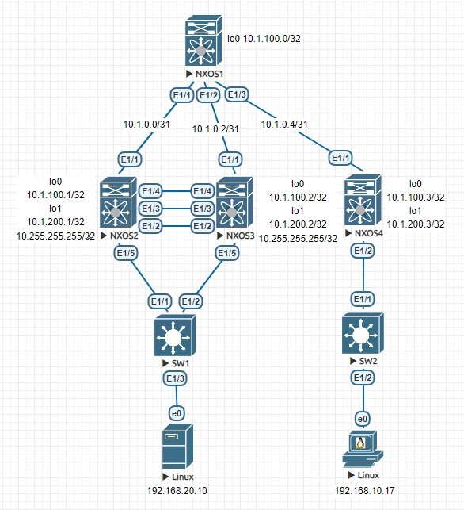
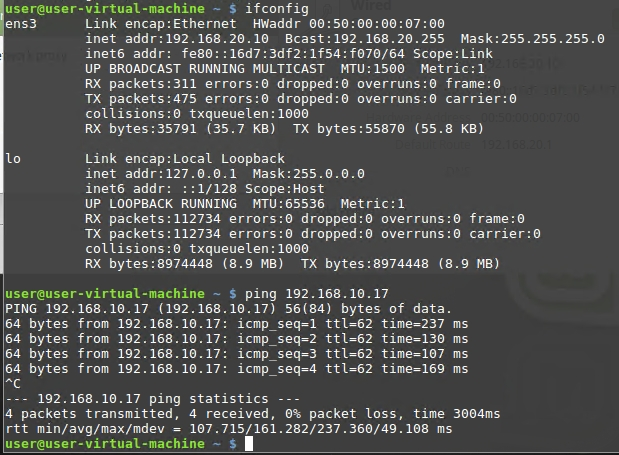
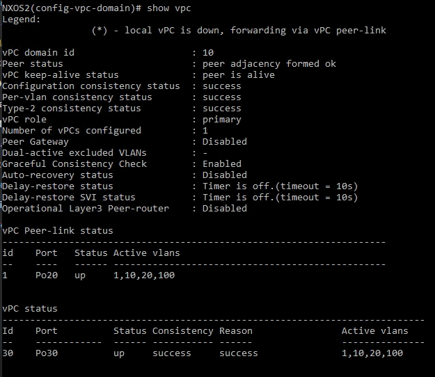
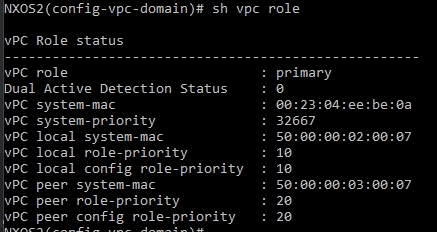

# VxLAN 3

## Цель:

**Настроить отказоустойчивое подключение клиентов с использованием VPC**

## Решение:

**Топология:**

**Адреса p2p каналов:**

|  Узел сети уровня Spine | порт| Адрес Spine  | Узел сети уровня Leaf | порт | Адрес Leaf     | Сеть           |
|---------|---|-------------|-----------|------|---|----------------|
| NXOS1 | Eth1   | 10.1.0.0  | NXOS2 |Eth1    | 10.1.0.1 | 10.1.0.0/31  |
| NXOS1 | Eth2   | 10.1.0.2  | NXOS3 |Eth1    | 10.1.0.3 | 10.1.0.2/31  |
| NXOS1 | Eth3   | 10.1.0.4  | NXOS4 |Eth1    | 10.1.0.5 | 10.1.0.4/31  |

**Адреса Loopback'ов:**

| Свитч  | Адрес Lo0  | Адрес lo1 | lo1 secondary|
|--------|------------|-----------|--------------|
| NXOS1 | 10.1.100.0 |             |   
| NXOS2  | 10.1.100.1 | 10.1.200.1  | 10.255.255.255
| NXOS3  | 10.1.100.2 | 10.1.200.2  | 10.255.255.255
| NXOS4  | 10.1.100.3 | 10.1.200.3  |

**Keep Alive link на Et 1/4**

NXOS2 - 1.1.1.0/31

NXOS3 - 1.1.1.1/31

### 0. Настройки Underlay и Overlay описывались ранее, настроен EVPN с симметричным IRB, клиенты видят друг друга

### 1. Настройка vPC на NXOS2 и NXOS3

*Включаем vPC и LACP (агрегирования каналов)*

feature vpc
feature lacp

*Настраиваем Keep Alive Link на портах Et 1/4*

*Сперва создаем отдельный vrf*

vrf context keepalive

*Затем настраиваем сам интерфейс, помещаем его в новый VRF и задаем ip адрес*

interface Ethernet1/4

  no switchport

  vrf member keepalive

  ip address 1.1.1.0/31

  no shutdown

*создаем vPC domain*

vpc domain 10

*задаем приоритет (ниже - приоритетнее)*

role priority 10

*указываем адрес другого конца линка для проверки активности удаленного узла*

peer-keepalive destination 1.1.1.1 source 1.1.1.0 vrf keepalive

*настраиваем оба vPC узла в качестве root bridge для Spanning Tree домена*

peer-switch

*включим задежку восствновления работы vPC до полного восстановления после сбоя*

delay restore 10

*Настраиваем Peer Link для передачи управляющего траффика и информации о состоянии*

interface ethernet 1/2-3

no shutdown

*Добавляем интерфейсы в port channel 20*

channel-group 20 mode active

*Настроим сам port channel*

interface port-channel 20

no shutdown

switchport mode trunk

vpc peer-link

*настраиваем порты к нижестоящему коммутатору*

interface eth 1/5

channel-group 30 mode active

switchport mode trunk

switchport trunk allowed vlan all

vpc 30

**Проверяем что vPC поднялся**

*vPC system mac одинаков на NXOS2 и NXOS3*

Полный конфиг NXOS1

<pre><code>
NXOS1# sh run

!Command: show running-config
!No configuration change since last restart
!Time: Tue Aug 22 15:33:44 2023

version 9.2(2) Bios:version
hostname NXOS1
vdc NXOS1 id 1
  limit-resource vlan minimum 16 maximum 4094
  limit-resource vrf minimum 2 maximum 4096
  limit-resource port-channel minimum 0 maximum 511
  limit-resource u4route-mem minimum 248 maximum 248
  limit-resource u6route-mem minimum 96 maximum 96
  limit-resource m4route-mem minimum 58 maximum 58
  limit-resource m6route-mem minimum 8 maximum 8

nv overlay evpn
feature ospf
feature bgp
feature fabric forwarding
feature interface-vlan
feature vn-segment-vlan-based
feature nv overlay

no password strength-check
username admin password 5 $5$PNLCMB$X.ZaJuYyDzkqTruc7Q2LPkkVdwIE.fcwGclMKPiwpA5
 role network-admin
ip domain-lookup
copp profile strict
snmp-server user admin network-admin auth md5 0x60fb4ae284b0f0f0511c95429ee54d0b
 priv 0x60fb4ae284b0f0f0511c95429ee54d0b localizedkey

vlan 1

route-map RM-LOOPBACK permit 10
  match interface loopback0
route-map RM-NHU permit 10
  set ip next-hop unchanged
vrf context management

interface Vlan1

interface mgmt0
  vrf member management

interface loopback0
  ip address 10.1.100.0/32
cli alias name wr copy running-config startup-config
line console
line vty
boot nxos bootflash:/nxos.9.2.2.bin
router bgp 65000
  router-id 10.1.100.0
  address-family ipv4 unicast
    redistribute direct route-map RM-LOOPBACK
  address-family l2vpn evpn
    retain route-target all
  neighbor 10.1.0.1
    remote-as 65001
    address-family ipv4 unicast
  neighbor 10.1.0.3
    remote-as 65002
    address-family ipv4 unicast
  neighbor 10.1.0.5
    remote-as 65003
    address-family ipv4 unicast
  neighbor 10.1.100.1
    remote-as 65001
    update-source loopback0
    ebgp-multihop 2
    address-family l2vpn evpn
      send-community
      send-community extended
      route-map RM-NHU out
  neighbor 10.1.100.2
    remote-as 65002
    update-source loopback0
    ebgp-multihop 2
    address-family l2vpn evpn
      send-community
      send-community extended
      route-map RM-NHU out
  neighbor 10.1.100.3
    remote-as 65003
    update-source loopback0
    ebgp-multihop 2
    address-family l2vpn evpn
      send-community
      send-community extended
      route-map RM-NHU out
</code></pre>

Полный конфиг NXOS2

<pre><code>
!Command: show running-config
!Running configuration last done at: Tue Aug 22 14:16:26 2023
!Time: Tue Aug 22 15:25:26 2023

version 9.2(2) Bios:version
hostname NXOS2
vdc NXOS2 id 1
  limit-resource vlan minimum 16 maximum 4094
  limit-resource vrf minimum 2 maximum 4096
  limit-resource port-channel minimum 0 maximum 511
  limit-resource u4route-mem minimum 248 maximum 248
  limit-resource u6route-mem minimum 96 maximum 96
  limit-resource m4route-mem minimum 58 maximum 58
  limit-resource m6route-mem minimum 8 maximum 8

cfs eth distribute
nv overlay evpn
feature bgp
feature fabric forwarding
feature interface-vlan
feature vn-segment-vlan-based
feature lacp
feature vpc
feature nv overlay

no password strength-check
username admin password 5 $5$LHAMPH$rNQAduW1QDzn3XDWebw2vZMuKzsEpaQXrohCBqCngp4
 role network-admin
ip domain-lookup
copp profile strict
snmp-server user admin network-admin auth md5 0x842513228c8296cb56d32aa77c5c91ed
 priv 0x842513228c8296cb56d32aa77c5c91ed localizedkey
rmon event 1 description FATAL(1) owner PMON@FATAL
rmon event 2 description CRITICAL(2) owner PMON@CRITICAL
rmon event 3 description ERROR(3) owner PMON@ERROR
rmon event 4 description WARNING(4) owner PMON@WARNING
rmon event 5 description INFORMATION(5) owner PMON@INFO

fabric forwarding anycast-gateway-mac 0000.0000.0001
vlan 1,10,20,100
vlan 10
  vn-segment 10010
vlan 20
  vn-segment 10020
vlan 100
  vn-segment 10100

route-map RM-LOOPBACK permit 10
  match interface loopback0 loopback1
vrf context TEST
  vni 10100
  rd 10.1.100.1:100
  address-family ipv4 unicast
    route-target import 100:100
    route-target import 100:100 evpn
    route-target export 100:100
    route-target export 100:100 evpn
vrf context keepalive
vrf context management
vpc domain 10
  peer-switch
  role priority 10
  peer-keepalive destination 1.1.1.1 source 1.1.1.0 vrf keepalive
  delay restore 10

interface Vlan1

interface Vlan10
  no shutdown
  vrf member TEST
  ip address 192.168.10.1/24
  fabric forwarding mode anycast-gateway

interface Vlan20
  no shutdown
  vrf member TEST
  ip address 192.168.20.1/24
  fabric forwarding mode anycast-gateway

interface Vlan100
  no shutdown
  vrf member TEST
  ip forward

interface port-channel20
  switchport mode trunk
  spanning-tree port type network
  vpc peer-link

interface port-channel30
  switchport mode trunk
  vpc 30

interface nve1
  no shutdown
  host-reachability protocol bgp
  source-interface loopback1
  global ingress-replication protocol bgp
  member vni 10010
  member vni 10020
  member vni 10100 associate-vrf

interface Ethernet1/1
  no switchport
  mtu 9216
  ip address 10.1.0.1/31
  no shutdown

interface Ethernet1/2
  switchport mode trunk
  channel-group 20 mode active

interface Ethernet1/3
  switchport mode trunk
  channel-group 20 mode active

interface Ethernet1/4
  no switchport
  vrf member keepalive
  ip address 1.1.1.0/31
  no shutdown

interface Ethernet1/5
  switchport mode trunk
  channel-group 30 mode active

interface Ethernet1/6
  switchport access vlan 10

interface mgmt0
  vrf member management

interface loopback0
  ip address 10.1.100.1/32

interface loopback1
  ip address 10.1.200.1/32
  ip address 10.255.255.255/32 secondary
cli alias name wr copy run start
line console
  exec-timeout 240
line vty
boot nxos bootflash:/nxos.9.2.2.bin
router bgp 65001
  router-id 10.1.100.1
  address-family ipv4 unicast
    redistribute direct route-map RM-LOOPBACK
  neighbor 10.1.0.0
    remote-as 65000
    address-family ipv4 unicast
  neighbor 10.1.100.0
    remote-as 65000
    update-source loopback0
    ebgp-multihop 2
    address-family l2vpn evpn
      send-community
      send-community extended
</code></pre>

Полный конфиг NXOS3

<pre><code>
NXOS3(config-vpc-domain)# sh run

!Command: show running-config
!Running configuration last done at: Tue Aug 22 14:16:33 2023
!Time: Tue Aug 22 15:26:40 2023

version 9.2(2) Bios:version
hostname NXOS3
vdc NXOS3 id 1
  limit-resource vlan minimum 16 maximum 4094
  limit-resource vrf minimum 2 maximum 4096
  limit-resource port-channel minimum 0 maximum 511
  limit-resource u4route-mem minimum 248 maximum 248
  limit-resource u6route-mem minimum 96 maximum 96
  limit-resource m4route-mem minimum 58 maximum 58
  limit-resource m6route-mem minimum 8 maximum 8

cfs eth distribute
nv overlay evpn
feature bgp
feature fabric forwarding
feature interface-vlan
feature vn-segment-vlan-based
feature lacp
feature vpc
feature nv overlay

no password strength-check
username admin password 5 $5$NNJLIB$p.aZ688sr.LDu7008Wlo.7HiecWtDDj3UxQ0xt1umuA
 role network-admin
ip domain-lookup
copp profile strict
snmp-server user admin network-admin auth md5 0xa0592966a86174abd3d57ff712f93617
 priv 0xa0592966a86174abd3d57ff712f93617 localizedkey
rmon event 1 description FATAL(1) owner PMON@FATAL
rmon event 2 description CRITICAL(2) owner PMON@CRITICAL
rmon event 3 description ERROR(3) owner PMON@ERROR
rmon event 4 description WARNING(4) owner PMON@WARNING
rmon event 5 description INFORMATION(5) owner PMON@INFO

fabric forwarding anycast-gateway-mac 0000.0000.0001
vlan 1,10,20,100
vlan 10
  vn-segment 10010
vlan 20
  vn-segment 10020
vlan 100
  vn-segment 10100

route-map RM-LOOPBACK permit 10
  match interface loopback0 loopback1
vrf context TEST
  vni 10100
  rd 10.1.100.2:100
  address-family ipv4 unicast
    route-target import 100:100
    route-target import 100:100 evpn
    route-target export 100:100
    route-target export 100:100 evpn
vrf context keepalive
vrf context management
vpc domain 10
  peer-switch
  role priority 20
  peer-keepalive destination 1.1.1.0 source 1.1.1.1 vrf keepalive
  delay restore 10

interface Vlan1

interface Vlan10
  no shutdown
  vrf member TEST
  ip address 192.168.10.1/24
  fabric forwarding mode anycast-gateway

interface Vlan20
  no shutdown
  vrf member TEST
  ip address 192.168.20.1/24
  fabric forwarding mode anycast-gateway

interface Vlan100
  no shutdown
  vrf member TEST
  ip forward

interface port-channel20
  switchport mode trunk
  spanning-tree port type network
  vpc peer-link

interface port-channel30
  switchport mode trunk
  vpc 30

interface nve1
  no shutdown
  host-reachability protocol bgp
  source-interface loopback1
  global ingress-replication protocol bgp
  member vni 10010
  member vni 10020
  member vni 10100 associate-vrf

interface Ethernet1/1
  no switchport
  mtu 9216
  ip address 10.1.0.3/31
  no shutdown

interface Ethernet1/2
  switchport mode trunk
  channel-group 20 mode active

interface Ethernet1/3
  switchport mode trunk
  channel-group 20 mode active

interface Ethernet1/4
  no switchport
  vrf member keepalive
  ip address 1.1.1.1/31
  no shutdown

interface Ethernet1/5
  switchport mode trunk
  channel-group 30 mode active

interface mgmt0
  vrf member management

interface loopback0
  ip address 10.1.100.2/32

interface loopback1
  ip address 10.1.200.2/32
  ip address 10.255.255.255/32 secondary
cli alias name wr copy run start
line console
  exec-timeout 240
line vty
boot nxos bootflash:/nxos.9.2.2.bin
router bgp 65002
  router-id 10.1.100.2
  address-family ipv4 unicast
    redistribute direct route-map RM-LOOPBACK
  neighbor 10.1.0.2
    remote-as 65000
    address-family ipv4 unicast
  neighbor 10.1.100.0
    remote-as 65000
    update-source loopback0
    ebgp-multihop 2
    address-family l2vpn evpn
      send-community
      send-community extended
</code></pre>

Полный конфиг NXOS4

<pre><code>
NXOS4(config-if)# sh run

!Command: show running-config
!Running configuration last done at: Tue Aug 22 11:48:59 2023
!Time: Tue Aug 22 15:27:56 2023

version 9.2(2) Bios:version
hostname NXOS4
vdc NXOS4 id 1
  limit-resource vlan minimum 16 maximum 4094
  limit-resource vrf minimum 2 maximum 4096
  limit-resource port-channel minimum 0 maximum 511
  limit-resource u4route-mem minimum 248 maximum 248
  limit-resource u6route-mem minimum 96 maximum 96
  limit-resource m4route-mem minimum 58 maximum 58
  limit-resource m6route-mem minimum 8 maximum 8

cfs eth distribute
nv overlay evpn
feature bgp
feature fabric forwarding
feature interface-vlan
feature vn-segment-vlan-based
feature lacp
feature vpc
feature nv overlay

no password strength-check
username admin password 5 $5$CAIMBL$PmBgw2lTD36P0O.CCZvmaCYZIAGAUn7E/w4er43qLn7
 role network-admin
ip domain-lookup
copp profile strict
snmp-server user admin network-admin auth md5 0xa95c3aac410ecd2e60cd349a21f666e8
 priv 0xa95c3aac410ecd2e60cd349a21f666e8 localizedkey
rmon event 1 description FATAL(1) owner PMON@FATAL
rmon event 2 description CRITICAL(2) owner PMON@CRITICAL
rmon event 3 description ERROR(3) owner PMON@ERROR
rmon event 4 description WARNING(4) owner PMON@WARNING
rmon event 5 description INFORMATION(5) owner PMON@INFO

fabric forwarding anycast-gateway-mac 0000.0000.0001
vlan 1,10,100
vlan 10
  vn-segment 10010
vlan 100
  vn-segment 10100

route-map RM-LOOPBACK permit 10
  match interface loopback0 loopback1
vrf context TEST
  vni 10100
  rd 10.1.100.3:100
  address-family ipv4 unicast
    route-target import 100:100
    route-target import 100:100 evpn
    route-target export 100:100
    route-target export 100:100 evpn
vrf context management

interface Vlan1

interface Vlan10
  no shutdown
  vrf member TEST
  ip address 192.168.10.1/24
  fabric forwarding mode anycast-gateway

interface Vlan100
  no shutdown
  vrf member TEST
  ip forward

interface nve1
  no shutdown
  host-reachability protocol bgp
  source-interface loopback1
  global ingress-replication protocol bgp
  member vni 10010
  member vni 10100 associate-vrf

interface Ethernet1/1
  no switchport
  mtu 9216
  ip address 10.1.0.5/31
  no shutdown

interface Ethernet1/2
  switchport mode trunk

interface Ethernet1/3
  switchport access vlan 10

interface mgmt0
  vrf member management

interface loopback0
  ip address 10.1.100.3/32

interface loopback1
  ip address 10.1.200.3/32
cli alias name wr copy run start
line console
  exec-timeout 240
line vty
boot nxos bootflash:/nxos.9.2.2.bin
router bgp 65003
  router-id 10.1.100.3
  address-family ipv4 unicast
    redistribute direct route-map RM-LOOPBACK
  neighbor 10.1.0.4
    remote-as 65000
    address-family ipv4 unicast
  neighbor 10.1.100.0
    remote-as 65000
    update-source loopback0
    ebgp-multihop 2
    address-family l2vpn evpn
      send-community
      send-community extended
</code></pre>

конфиг SW1

<pre><code>
SW1# sh run

!Command: show running-config
!Running configuration last done at: Tue Aug 22 10:23:22 2023
!Time: Tue Aug 22 15:30:55 2023

version 9.2(2) Bios:version
hostname SW1
feature lacp

vlan 1,10,20

vrf context management

interface port-channel30
  switchport mode trunk

interface Ethernet1/1
  switchport mode trunk
  channel-group 30 mode active

interface Ethernet1/2
  switchport mode trunk
  channel-group 30 mode active

interface Ethernet1/3
  switchport access vlan 20
</code></pre>

