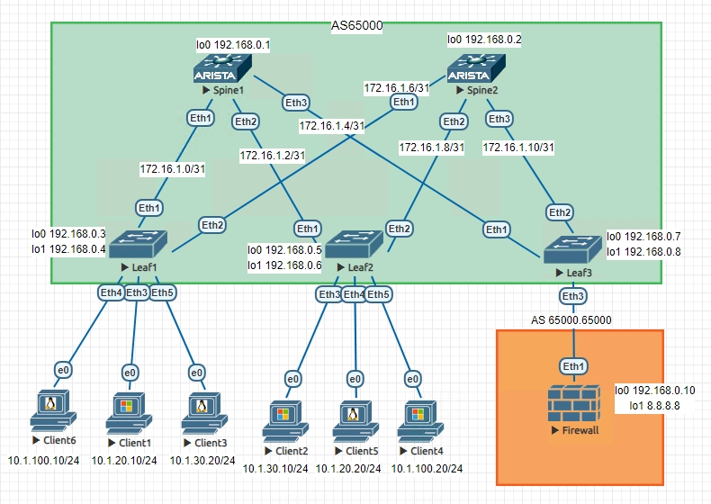
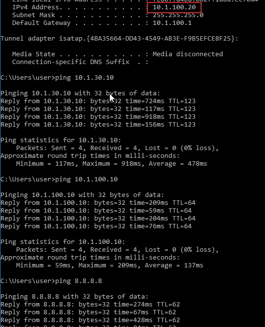
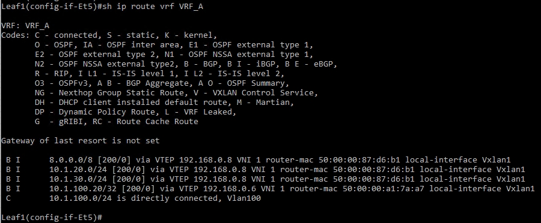
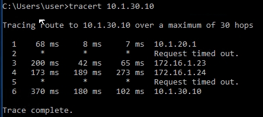

# VxLAN 4

## Цель:

**Реализовать передачу суммарных префиксов через EVPN route-type 5**


## Решение:

**Топология:**



**Адреса p2p каналов:**


|  Узел сети уровня Spine | порт| Адрес Spine    | Узел сети уровня Leaf | порт | Адрес Leaf     | Сеть           |
|---------|---|-------------|-----------|---------|---|----------------|
| Spine1 | Eth1   | 172.16.1.0  | Leaf1 |Eth1    | 172.16.1.1 | 172.16.1.0/31  |
| Spine1 | Eth2   | 172.16.1.2  | Leaf2 |Eth1    | 172.16.1.3 | 172.16.1.2/31  |
| Spine1 | Eth3   | 172.16.1.4  | Leaf3 |Eth1    | 172.16.1.5 | 172.16.1.4/31  |
| Spine2 | Eth1   | 172.16.1.6  | Leaf1 |Eth2    | 172.16.1.7 | 172.16.1.6/31  |
| Spine2 | Eth2   | 172.16.1.8  | Leaf2 |Eth2    | 172.16.1.9 | 172.16.1.8/31  |
| Spine2 | Eth3   | 172.16.1.10  | Leaf3 |Eth2    | 172.16.1.11| 172.16.1.10/31   |

**Адреса Loopback'ов:**

| Свитч  | Адрес Lo0  | Адрес lo1 | 
|--------|------------|-----------|
| Spine1 | 192.168.0.1 |             |   
| Spine2 | 192.168.0.2 |             | 
| Leaf1  | 192.168.0.3 | 192.168.0.4    | 
| Leaf2  | 192.168.0.5 | 192.168.0.6    |
| Leaf3  | 192.168.0.7 | 192.168.0.8    |
|   FW   | 192.168.0.10 | 8.8.8.8


### 0. Настройка Overlay и Underlay идентична настройкам в предыдущих лабах

### 1. Настрояка Firewall

```
<<<---Создадим саб-интерфейсы для пиринга с Leaf3
interface Ethernet1.1
   encapsulation dot1q vlan 100
   ip address 172.16.1.21/31
!
interface Ethernet1.2
   encapsulation dot1q vlan 20
   ip address 172.16.1.23/31
!
interface Ethernet1.3
   encapsulation dot1q vlan 30
   ip address 172.16.1.25/31
!
interface Loopback0
   ip address 192.168.0.10/32
!
interface Loopback1
   ip address 8.8.8.8/32
!
interface Management1
!
ip routing
!
ip prefix-list PRIVATE seq 10 permit 172.16.0.0/12 le 32
ip prefix-list PRIVATE seq 20 permit 192.168.0.0/16 le 32
ip prefix-list PRIVATE seq 30 permit 10.0.0.0/8 le 32
!
<<<---Исключаем приватные сети из нашего route-map:
route-map INTERNET deny 10
   match ip address prefix-list PRIVATE
!
route-map INTERNET permit 20
!
router bgp 65000.65000
   router-id 192.168.0.10
   neighbor 172.16.1.20 remote-as 65000.1
   neighbor 172.16.1.22 remote-as 65000.2
   neighbor 172.16.1.24 remote-as 65000.3
<<<---Суммируем сеть 8.0.0.0/8   
   aggregate-address 8.0.0.0/8 summary-only
<<<---и анансируем ее в процесс BGP   
   redistribute connected route-map INTERNET
!
```


### 2. Настройка Leaf3 aka Boarderleaf

```
vlan 20,30,100
!
vrf instance VRF_A
!
vrf instance VRF_B
!
vrf instance VRF_C
!
<<<---Создадим саб-интерфейсы для пиринга с Firewall
interface Ethernet3.1
   encapsulation dot1q vlan 100
   vrf VRF_A
   ip address 172.16.1.20/31
!
interface Ethernet3.2
   encapsulation dot1q vlan 20
   vrf VRF_B
   ip address 172.16.1.22/31
!
interface Ethernet3.3
   encapsulation dot1q vlan 30
   vrf VRF_C
   ip address 172.16.1.24/31
!
interface Loopback0
   ip address 192.168.0.7/32
!
interface Loopback1
   ip address 192.168.0.8/32
!
interface Management1
!
interface Vlan20
   vrf VRF_B
   ip address virtual 10.1.20.1/24
!
interface Vlan30
   vrf VRF_C
   ip address virtual 10.1.30.1/24
!
interface Vlan100
   vrf VRF_A
   ip address virtual 10.1.100.1/24
!
interface Vxlan1
   vxlan source-interface Loopback1
   vxlan udp-port 4789
<<<---Мапим l3 vni:   
   vxlan vrf VRF_A vni 1
   vxlan vrf VRF_B vni 2
   vxlan vrf VRF_C vni 3
!
ip virtual-router mac-address 00:00:22:22:33:33
!
ip routing
ip routing vrf VRF_A
ip routing vrf VRF_B
ip routing vrf VRF_C
!
ip prefix-list LOOPBACKS seq 10 permit 192.168.0.0/24 le 32
ip prefix-list PROD seq 10 permit 10.1.0.0/16 le 32
!
mpls ip
!
route-map LOOPBACKS permit 10
   match ip address prefix-list LOOPBACKS
!
route-map PROD permit 10
   match ip address prefix-list PROD
!
router bgp 65000
   router-id 192.168.0.7
   maximum-paths 2
   neighbor SPINE_OVERLAY peer group
   neighbor SPINE_OVERLAY remote-as 65000
   neighbor SPINE_OVERLAY update-source Loopback0
   neighbor SPINE_OVERLAY send-community
   neighbor SPINE_UNDERLAY peer group
   neighbor SPINE_UNDERLAY remote-as 65000
   neighbor 172.16.1.4 peer group SPINE_UNDERLAY
   neighbor 172.16.1.10 peer group SPINE_UNDERLAY
   neighbor 192.168.0.1 peer group SPINE_OVERLAY
   neighbor 192.168.0.2 peer group SPINE_OVERLAY
   redistribute connected route-map LOOPBACKS
   !
   address-family evpn
      neighbor SPINE_OVERLAY activate
   !
   address-family ipv4
      no neighbor SPINE_OVERLAY activate
   !
   vrf VRF_A
      rd 192.168.0.7:10001
      route-target import evpn 1:10001
      route-target export evpn 1:10001
      neighbor 172.16.1.21 remote-as 65000.65000
<<<---Указываем локальную AS для этого соседа      
      neighbor 172.16.1.21 local-as 65000.1 no-prepend replace-as
      aggregate-address 10.1.100.0/24 summary-only
      redistribute connected route-map PROD
   !
   vrf VRF_B
      rd 192.168.0.7:10002
      route-target import evpn 1:10002
      route-target export evpn 1:10002
      neighbor 172.16.1.23 remote-as 65000.65000
      neighbor 172.16.1.23 local-as 65000.2 no-prepend replace-as
      aggregate-address 10.1.20.0/24 summary-only
      redistribute connected route-map PROD
   !
   vrf VRF_C
      rd 192.168.0.7:10003
      route-target import evpn 1:10003
      route-target export evpn 1:10003
      neighbor 172.16.1.25 remote-as 65000.65000
      neighbor 172.16.1.25 local-as 65000.3 no-prepend replace-as
      aggregate-address 10.1.30.0/24 summary-only
      redistribute connected route-map PROD
!
```

**Проверим, что клиенты видят друг друга и "интернет"**



**В таблицах маршрутизации на свитчах видем все VLAN'ы и суммарный маршрут, полученные с Leaf3**



**Видим, что траффик идет через Firewall**



<details>
<summary>Полный конфиг Spine1</summary>
<pre><code>
Spine1(config)#sh run
! Command: show running-config
! device: Spine1 (vEOS-lab, EOS-4.26.4M)
!
! boot system flash:/vEOS-lab.swi
!
no aaa root
!
transceiver qsfp default-mode 4x10G
!
service routing protocols model multi-agent
!
hostname Spine1
!
spanning-tree mode mstp
!
clock timezone Europe/Moscow
!
interface Ethernet1
   no switchport
   ip address 172.16.1.0/31
!
interface Ethernet2
   no switchport
   ip address 172.16.1.2/31
!
interface Ethernet3
   no switchport
   ip address 172.16.1.4/31
!
interface Ethernet4
!
interface Ethernet5
!
interface Ethernet6
!
interface Ethernet7
!
interface Ethernet8
!
interface Loopback0
   ip address 192.168.0.1/32
!
interface Management1
!
ip routing
!
ip prefix-list LOOPBACKS seq 10 permit 192.168.0.0/24 le 32
!
mpls ip
!
route-map LOOPBACKS permit 10
   match ip address prefix-list LOOPBACKS
!
peer-filter AS_FILTER
   10 match as-range 65000-65999 result accept
!
router bgp 65000
   router-id 192.168.0.1
   maximum-paths 4
   bgp listen range 192.168.0.0/24 peer-group LEAF_OVERLAY peer-filter LEAF_AS_RANGE
   bgp listen range 172.16.1.0/24 peer-group LEAF_UNDERLAY peer-filter AS_FILTER
   neighbor LEAF_OVERLAY peer group
   neighbor LEAF_OVERLAY update-source Loopback0
   neighbor LEAF_OVERLAY ebgp-multihop 2
   neighbor LEAF_OVERLAY route-reflector-client
   neighbor LEAF_OVERLAY send-community
   neighbor LEAF_UNDERLAY peer group
   neighbor LEAF_UNDERLAY next-hop-self
   neighbor LEAF_UNDERLAY route-reflector-client
   redistribute connected route-map LOOPBACKS
   !
   address-family evpn
      neighbor LEAF_OVERLAY activate
   !
   address-family ipv4
      no neighbor LEAF_OVERLAY activate
!
end
</code></pre>
</details>

<details>
<summary>Полный конфиг Spine2</summary>
<pre><code>
Spine2(config)#sh run
! Command: show running-config
! device: Spine2 (vEOS-lab, EOS-4.26.4M)
!
! boot system flash:/vEOS-lab.swi
!
no aaa root
!
transceiver qsfp default-mode 4x10G
!
service routing protocols model multi-agent
!
hostname Spine2
!
spanning-tree mode mstp
!
clock timezone Europe/Moscow
!
interface Ethernet1
   no switchport
   ip address 172.16.1.6/31
!
interface Ethernet2
   no switchport
   ip address 172.16.1.8/31
!
interface Ethernet3
   no switchport
   ip address 172.16.1.10/31
!
interface Ethernet4
!
interface Ethernet5
!
interface Ethernet6
!
interface Ethernet7
!
interface Ethernet8
!
interface Loopback0
   ip address 192.168.0.2/32
!
interface Management1
!
ip routing
!
ip prefix-list LOOPBACKS seq 10 permit 192.168.0.0/24 le 32
!
mpls ip
!
route-map LOOPBACKS permit 10
   match ip address prefix-list LOOPBACKS
!
peer-filter AS_FILTER
   10 match as-range 65000-65999 result accept
!
router bgp 65000
   router-id 192.168.0.2
   maximum-paths 4
   bgp listen range 192.168.0.0/24 peer-group LEAF_OVERLAY peer-filter LEAF_AS_RANGE
   bgp listen range 172.16.1.0/24 peer-group LEAF_UNDERLAY peer-filter AS_FILTER
   neighbor LEAF_OVERLAY peer group
   neighbor LEAF_OVERLAY update-source Loopback0
   neighbor LEAF_OVERLAY ebgp-multihop 2
   neighbor LEAF_OVERLAY route-reflector-client
   neighbor LEAF_OVERLAY send-community
   neighbor LEAF_UNDERLAY peer group
   neighbor LEAF_UNDERLAY next-hop-self
   neighbor LEAF_UNDERLAY route-reflector-client
   redistribute connected route-map LOOPBACKS
   !
   address-family evpn
      neighbor LEAF_OVERLAY activate
   !
   address-family ipv4
      no neighbor LEAF_OVERLAY activate
!
end
</code></pre>
</details>

<details>
<summary>Полный конфиг Leaf1</summary>
<pre><code>
Leaf1(config-if-Et5)#sh run
! Command: show running-config
! device: Leaf1 (vEOS-lab, EOS-4.26.4M)
!
! boot system flash:/vEOS-lab.swi
!
no aaa root
!
transceiver qsfp default-mode 4x10G
!
service routing protocols model multi-agent
!
hostname Leaf1
!
spanning-tree mode mstp
!
clock timezone Europe/Moscow
!
vlan 20,30,100
!
vrf instance VRF_A
!
vrf instance VRF_B
!
vrf instance VRF_C
!
interface Ethernet1
   no switchport
   ip address 172.16.1.1/31
!
interface Ethernet2
   no switchport
   ip address 172.16.1.7/31
!
interface Ethernet3
   switchport access vlan 20
!
interface Ethernet4
   switchport access vlan 100
!
interface Ethernet5
   switchport access vlan 30
!
interface Ethernet6
!
interface Ethernet7
!
interface Ethernet8
!
interface Loopback0
   ip address 192.168.0.3/32
!
interface Loopback1
   ip address 192.168.0.4/32
!
interface Management1
!
interface Vlan20
   vrf VRF_B
   ip address virtual 10.1.20.1/24
!
interface Vlan30
   vrf VRF_C
   ip address virtual 10.1.30.1/24
!
interface Vlan100
   vrf VRF_A
   ip address virtual 10.1.100.1/24
!
interface Vxlan1
   vxlan source-interface Loopback1
   vxlan udp-port 4789
   vxlan vlan 20,30,100 vni 10020,10030,10100
   vxlan vrf VRF_A vni 1
   vxlan vrf VRF_B vni 2
   vxlan vrf VRF_C vni 3
!
ip virtual-router mac-address 00:00:22:22:33:33
!
ip routing
ip routing vrf VRF_A
ip routing vrf VRF_B
ip routing vrf VRF_C
!
ip prefix-list LOOPBACKS seq 10 permit 192.168.0.0/24 le 32
!
mpls ip
!
route-map LOOPBACKS permit 10
   match ip address prefix-list LOOPBACKS
!
router bgp 65000
   router-id 192.168.0.3
   maximum-paths 2
   neighbor SPINE_OVERLAY peer group
   neighbor SPINE_OVERLAY remote-as 65000
   neighbor SPINE_OVERLAY update-source Loopback0
   neighbor SPINE_OVERLAY send-community
   neighbor SPINE_UNDERLAY peer group
   neighbor SPINE_UNDERLAY remote-as 65000
   neighbor 172.16.1.0 peer group SPINE_UNDERLAY
   neighbor 172.16.1.6 peer group SPINE_UNDERLAY
   neighbor 192.168.0.1 peer group SPINE_OVERLAY
   neighbor 192.168.0.2 peer group SPINE_OVERLAY
   redistribute connected route-map LOOPBACKS
   !
   vlan 100
      rd 192.168.0.3:10100
      route-target both 1:10100
      redistribute learned
   !
   vlan 20
      rd 192.168.0.3:10020
      route-target both 1:10020
      redistribute learned
   !
   vlan 30
      rd 192.168.0.3:10030
      route-target both 1:10030
      redistribute learned
   !
   address-family evpn
      neighbor SPINE_OVERLAY activate
   !
   address-family ipv4
      no neighbor SPINE_OVERLAY activate
   !
   vrf VRF_A
      rd 192.168.0.3:10001
      route-target import evpn 1:10001
      route-target export evpn 1:10001
   !
   vrf VRF_B
      rd 192.168.0.3:10002
      route-target import evpn 1:10002
      route-target export evpn 1:10002
   !
   vrf VRF_C
      rd 192.168.0.3:10003
      route-target import evpn 1:10003
      route-target export evpn 1:10003
!
end
</code></pre>
</details>

<details>
<summary>Полный конфиг Leaf2</summary>
<pre><code>
Leaf2(config-if-Et5)#sh run
! Command: show running-config
! device: Leaf2 (vEOS-lab, EOS-4.26.4M)
!
! boot system flash:/vEOS-lab.swi
!
no aaa root
!
transceiver qsfp default-mode 4x10G
!
service routing protocols model multi-agent
!
hostname Leaf2
!
spanning-tree mode mstp
!
clock timezone Europe/Moscow
!
vlan 20,30,100
!
vrf instance VRF_A
!
vrf instance VRF_B
!
vrf instance VRF_C
!
interface Ethernet1
   no switchport
   ip address 172.16.1.3/31
!
interface Ethernet2
   no switchport
   ip address 172.16.1.9/31
!
interface Ethernet3
   switchport access vlan 30
!
interface Ethernet4
   switchport access vlan 20
!
interface Ethernet5
   switchport access vlan 100
!
interface Ethernet6
!
interface Ethernet7
!
interface Ethernet8
!
interface Loopback0
   ip address 192.168.0.5/32
!
interface Loopback1
   ip address 192.168.0.6/32
!
interface Management1
!
interface Vlan20
   vrf VRF_B
   ip address virtual 10.1.20.1/24
!
interface Vlan30
   vrf VRF_C
   ip address virtual 10.1.30.1/24
!
interface Vlan100
   vrf VRF_A
   ip address virtual 10.1.100.1/24
!
interface Vxlan1
   vxlan source-interface Loopback1
   vxlan udp-port 4789
   vxlan vlan 20,30,100 vni 10020,10030,10100
   vxlan vrf VRF_A vni 1
   vxlan vrf VRF_B vni 2
   vxlan vrf VRF_C vni 3
!
ip virtual-router mac-address 00:00:22:22:33:33
!
ip routing
ip routing vrf VRF_A
ip routing vrf VRF_B
ip routing vrf VRF_C
!
ip prefix-list LOOPBACKS seq 10 permit 192.168.0.0/24 le 32
!
mpls ip
!
route-map LOOPBACKS permit 10
   match ip address prefix-list LOOPBACKS
!
router bgp 65000
   router-id 192.168.0.5
   maximum-paths 2
   neighbor SPINE_OVERLAY peer group
   neighbor SPINE_OVERLAY remote-as 65000
   neighbor SPINE_OVERLAY update-source Loopback0
   neighbor SPINE_OVERLAY send-community
   neighbor SPINE_UNDERLAY peer group
   neighbor SPINE_UNDERLAY remote-as 65000
   neighbor 172.16.1.2 peer group SPINE_UNDERLAY
   neighbor 172.16.1.8 peer group SPINE_UNDERLAY
   neighbor 192.168.0.1 peer group SPINE_OVERLAY
   neighbor 192.168.0.2 peer group SPINE_OVERLAY
   redistribute connected route-map LOOPBACKS
   !
   vlan 100
      rd 192.168.0.5:10100
      route-target both 1:10100
      redistribute learned
   !
   vlan 20
      rd 192.168.0.5:10020
      route-target both 1:10020
      redistribute learned
   !
   vlan 30
      rd 192.168.0.5:10030
      route-target both 1:10030
      redistribute learned
   !
   address-family evpn
      neighbor SPINE_OVERLAY activate
   !
   address-family ipv4
      no neighbor SPINE_OVERLAY activate
   !
   vrf VRF_A
      rd 192.168.0.5:10001
      route-target import evpn 1:10001
      route-target export evpn 1:10001
   !
   vrf VRF_B
      rd 192.168.0.5:10002
      route-target import evpn 1:10002
      route-target export evpn 1:10002
   !
   vrf VRF_C
      rd 192.168.0.5:10003
      route-target import evpn 1:10003
      route-target export evpn 1:10003
!
end
</code></pre>
</details>

<details>
<summary>конфиг Leaf3</summary>
<pre><code>
Leaf3(config-if-Vl30)#sh run
! Command: show running-config
! device: Leaf3 (vEOS-lab, EOS-4.26.4M)
!
! boot system flash:/vEOS-lab.swi
!
no aaa root
!
transceiver qsfp default-mode 4x10G
!
service routing protocols model multi-agent
!
hostname Leaf3
!
spanning-tree mode mstp
!
clock timezone Europe/Moscow
!
vlan 20,30,100
!
vrf instance VRF_A
!
vrf instance VRF_B
!
vrf instance VRF_C
!
interface Ethernet1
   no switchport
   ip address 172.16.1.5/31
!
interface Ethernet2
   no switchport
   ip address 172.16.1.11/31
!
interface Ethernet3
   no switchport
!
interface Ethernet3.1
   encapsulation dot1q vlan 100
   vrf VRF_A
   ip address 172.16.1.20/31
!
interface Ethernet3.2
   encapsulation dot1q vlan 20
   vrf VRF_B
   ip address 172.16.1.22/31
!
interface Ethernet3.3
   encapsulation dot1q vlan 30
   vrf VRF_C
   ip address 172.16.1.24/31
!
interface Ethernet4
   switchport access vlan 20
!
interface Ethernet5
!
interface Ethernet6
!
interface Ethernet7
!
interface Ethernet8
!
interface Loopback0
   ip address 192.168.0.7/32
!
interface Loopback1
   ip address 192.168.0.8/32
!
interface Management1
!
interface Vlan20
   vrf VRF_B
   ip address virtual 10.1.20.1/24
!
interface Vlan30
   vrf VRF_C
   ip address virtual 10.1.30.1/24
!
interface Vlan100
   vrf VRF_A
   ip address virtual 10.1.100.1/24
!
interface Vxlan1
   vxlan source-interface Loopback1
   vxlan udp-port 4789
   vxlan vrf VRF_A vni 1
   vxlan vrf VRF_B vni 2
   vxlan vrf VRF_C vni 3
!
ip virtual-router mac-address 00:00:22:22:33:33
!
ip routing
ip routing vrf VRF_A
ip routing vrf VRF_B
ip routing vrf VRF_C
!
ip prefix-list LOOPBACKS seq 10 permit 192.168.0.0/24 le 32
ip prefix-list PROD seq 10 permit 10.1.0.0/16 le 32
!
mpls ip
!
route-map LOOPBACKS permit 10
   match ip address prefix-list LOOPBACKS
!
route-map PROD permit 10
   match ip address prefix-list PROD
!
router bgp 65000
   router-id 192.168.0.7
   maximum-paths 2
   neighbor SPINE_OVERLAY peer group
   neighbor SPINE_OVERLAY remote-as 65000
   neighbor SPINE_OVERLAY update-source Loopback0
   neighbor SPINE_OVERLAY send-community
   neighbor SPINE_UNDERLAY peer group
   neighbor SPINE_UNDERLAY remote-as 65000
   neighbor 172.16.1.4 peer group SPINE_UNDERLAY
   neighbor 172.16.1.10 peer group SPINE_UNDERLAY
   neighbor 192.168.0.1 peer group SPINE_OVERLAY
   neighbor 192.168.0.2 peer group SPINE_OVERLAY
   redistribute connected route-map LOOPBACKS
   !
   address-family evpn
      neighbor SPINE_OVERLAY activate
   !
   address-family ipv4
      no neighbor SPINE_OVERLAY activate
   !
   vrf VRF_A
      rd 192.168.0.7:10001
      route-target import evpn 1:10001
      route-target export evpn 1:10001
      neighbor 172.16.1.21 remote-as 4259905000
      neighbor 172.16.1.21 local-as 4259840001 no-prepend replace-as
      aggregate-address 10.1.100.0/24 summary-only
      redistribute connected route-map PROD
   !
   vrf VRF_B
      rd 192.168.0.7:10002
      route-target import evpn 1:10002
      route-target export evpn 1:10002
      neighbor 172.16.1.23 remote-as 4259905000
      neighbor 172.16.1.23 local-as 4259840002 no-prepend replace-as
      aggregate-address 10.1.20.0/24 summary-only
      redistribute connected route-map PROD
   !
   vrf VRF_C
      rd 192.168.0.7:10003
      route-target import evpn 1:10003
      route-target export evpn 1:10003
      neighbor 172.16.1.25 remote-as 4259905000
      neighbor 172.16.1.25 local-as 4259840003 no-prepend replace-as
      aggregate-address 10.1.30.0/24 summary-only
      redistribute connected route-map PROD
!
end
</code></pre>
</details>

<details>
<summary>конфиг Firewall</summary>
<pre><code>
Firewall(config)#sh run
! Command: show running-config
! device: Firewall (vEOS-lab, EOS-4.26.4M)
!
! boot system flash:/vEOS-lab.swi
!
no aaa root
!
transceiver qsfp default-mode 4x10G
!
service routing protocols model ribd
!
no logging console
!
hostname Firewall
!
spanning-tree mode mstp
!
clock timezone Europe/Moscow
!
interface Ethernet1
   no switchport
!
interface Ethernet1.1
   encapsulation dot1q vlan 100
   ip address 172.16.1.21/31
!
interface Ethernet1.2
   encapsulation dot1q vlan 20
   ip address 172.16.1.23/31
!
interface Ethernet1.3
   encapsulation dot1q vlan 30
   ip address 172.16.1.25/31
!
interface Ethernet2
!
interface Ethernet3
!
interface Ethernet4
!
interface Ethernet5
!
interface Ethernet6
!
interface Ethernet7
!
interface Ethernet8
!
interface Loopback0
   ip address 192.168.0.10/32
!
interface Loopback1
   ip address 8.8.8.8/32
!
interface Management1
!
ip routing
!
ip prefix-list PRIVATE seq 10 permit 172.16.0.0/12 le 32
ip prefix-list PRIVATE seq 20 permit 192.168.0.0/16 le 32
ip prefix-list PRIVATE seq 30 permit 10.0.0.0/8 le 32
!
route-map INTERNET deny 10
   match ip address prefix-list PRIVATE
!
route-map INTERNET permit 20
!
router bgp 4259905000
   router-id 192.168.0.10
   neighbor 172.16.1.20 remote-as 4259840001
   neighbor 172.16.1.22 remote-as 4259840002
   neighbor 172.16.1.24 remote-as 4259840003
   aggregate-address 8.0.0.0/8 summary-only
   redistribute connected route-map INTERNET
!
end
</code></pre>
</details>


