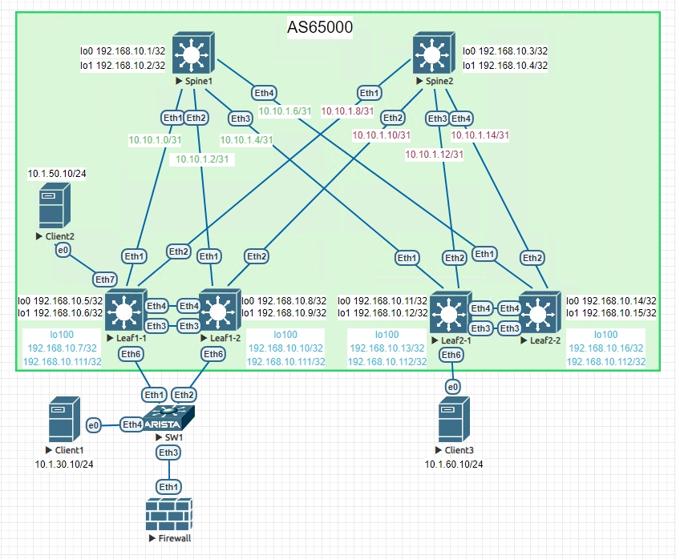
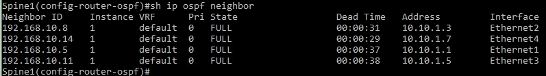
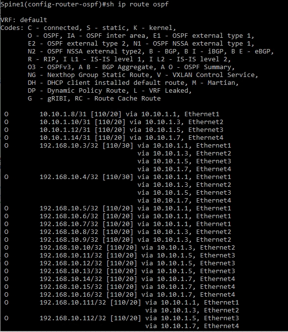
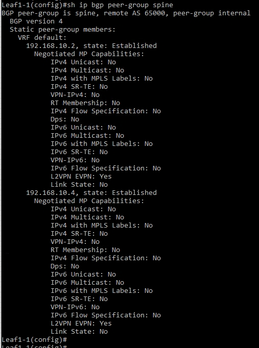

# Организация EVPN/VXLAN-фабрики для масштабирования существующей сети ЦОД

## Цель:

**Масштабировать существующую сеть ЦОД.**


## Решение:

**Топология:**



**Адреса p2p каналов:**


|  Узел сети уровня Spine | порт| Адрес Spine    | Узел сети уровня Leaf | порт | Адрес Leaf     | Сеть           |
|---------|---|-------------|-----------|---------|---|----------------|
| Spine1 | Eth1   | 10.10.1.0  | Leaf1-1 |Eth1    | 10.10.1.1 | 10.10.1.0/31  |
| Spine1 | Eth2   | 10.10.1.2  | Leaf1-2 |Eth1    | 10.10.1.3 | 10.10.1.2/31  |
| Spine1 | Eth3   | 10.10.1.4  | Leaf2-1 |Eth1    | 10.10.1.5 | 10.10.1.4/31  |
| Spine1 | Eth4   | 10.10.1.6  | Leaf2-2 |Eth1    | 10.10.1.7 | 10.10.1.6/31  |
| Spine2 | Eth1   | 10.10.1.8  | Leaf1-1 |Eth2    | 10.10.1.9 | 10.10.1.8/31  |
| Spine2 | Eth2   | 10.10.1.10  | Leaf1-2 |Eth2    | 10.10.1.11 | 10.10.1.10/31  |
| Spine2 | Eth3   | 10.10.1.12  | Leaf2-1 |Eth2    | 10.10.1.13| 10.10.1.12/31   |
| Spine2 | Eth4   | 10.10.1.14  | Leaf2-2 |Eth2    | 10.10.1.15| 10.10.1.14/31   |

**Адреса Loopback'ов:**

| Свитч  | Адрес Lo0  | Адрес lo1 | Адрес lo100 | Адрес lo100 sec |
|--------|------------|-----------|-------------|-----------------|
| Spine1 | 192.168.10.1 | 192.168.10.2 |  
| Spine2 | 192.168.10.3 | 192.168.10.4 |  
| Leaf1-1  | 192.168.10.5 | 192.168.10.6 | 192.168.10.7 | 192.168.10.111 | 
| Leaf1-2  | 192.168.10.8 | 192.168.10.9  | 192.168.10.10 | 192.168.10.111 |
| Leaf2-1  | 192.168.10.11 | 192.168.10.12 | 192.168.10.13 | 192.168.10.112 |
| Leaf2-2  | 192.168.10.14 | 192.168.10.15 | 192.168.10.16 | 192.168.10.112 |
|   FW   | 8.8.8.8

### В качестве технологии реализации было выбрано построение сетевой инфраструктуры ЦОД с организацией L3-фабрики с использованием технологии инкапсуляции VxLAN для обеспечения логического разделения клиентского data-трафика в overlay.
### Для сигнализации control plane используется протокол BGP с расширением EVPN.


### 1. Настрояка OSPF для Underlay

*Включаем маршрутизацию и процесс OSPF*

ip routing

router ospf 1

*Задаем router-id по ip адресу интерфейса Lo0*

router-id 192.168.10.X

*Добавляем peer-линки и лупбеки в area 0*

*Во избежаний неточностейпри настройке wildcard на всех интерфейсах протокола ospf устанавливается в 0.0.0.0. Таким образом протокол активируется только на интерфейсе с указанным адресом.*

 network 10.10.1.X/32 area 0.0.0.0

 network 10.10.1.Y/32 area 0.0.0.0

 network ip_lo0/32 area 0.0.0.0

 network ip_lo1/32 area 0.0.0.0

*на leaf'ах + lo100* 

 network ip_lo100/32 area 0.0.0.0

 network ip_lo100_sec/32 area 0.0.0.0

 **Проверяем, что видим соседей**

 

 **и маршруты**



 

### 2. Настройка iBGP для Overlay

*Включаем процесс BGP*

router bgp 65000

*Задаем router-id по ip адресу интерфейса Lo1*

router-id 192.168.10.X

*Разрешаем до 16 маршрутов для каждой подсети*

maximum-paths 16

*прописываем соседей, создаем peer группы spine\leaf, указываем что свитчи должны быть в AS 65000*

neighbor leaf peer group

neighbor leaf remote-as 65000

neighbor 192.168.10.X peer group leaf

neighbor 192.168.10.Y peer group leaf

neighbor 192.168.10.XX peer group leaf

neighbor 192.168.10.YY peer group leaf

*используем ip адрес loopback1 в качестве next-hop для EBGP*

neighbor leaf update-source Loopback1

*Включаем send-community (включает и standard, и extended) для рассылки route target*

neighbor leaf send-community

*так как используем iBGP настраиваем Spine'ы в качестве route reflector*

neighbor leaf route-reflector-client

**Проверяем, что соседство установилось**




**Проверим, что клиенты видят друг друга и "интернет"**


**В таблицах маршрутизации на свитчах видем все VLAN'ы и суммарный маршрут, полученные с Leaf3**


**Видим, что траффик идет через Firewall**


### 3. Настройка VXLAN EVPN

*На Leaf'ах создаем vlan'ы*

vlan 10,20,30,40,50,60,70

*Часть vlanov (50 и 60) будет использовать distributed gateway внутои фабрики, остальные будут маршрутизироваться через Firewall для фильтрации траффика*

*для вланов 50, 60 и 70*

*создаем отдельный vfr*

vrf instance DS

*включаем для него маршрутизацию*

ip routing vrf DS

*создаем интерфейсы vlan и задаем виртуальный ip адрес для distributed gateway, общий для всех свитчей*

```
interface Vlan50
   vrf DS
   ip address virtual 10.1.50.1/24
!
interface Vlan60
   vrf DS
   ip address virtual 10.1.60.1/24
!
interface Vlan70
   vrf DS
   ip address 10.100.70.2/24

```

*Для всез vlan'ов. Создаем виртуальные mac-адрес, так же одинаковый для всех VTEP'ов*

ip virtual-router mac-address 00:00:22:22:33:33

*Создаем vrf'ы для наших vlan'ов*

router bgp 65000

vlan 20

*Указываем route destinguisher (loopback:vni)*

rd 192.168.10.6:10020

*и route target (ASN:VNI)*

route-target both 1:10020

*Распределяем а этот VRF выученные ip адреса*

redistribute learned

```
   vlan 10
      rd 192.168.10.6:10010
      route-target both 1:10010
      redistribute learned
   !
   vlan 20
      rd 192.168.10.6:10020
      route-target both 1:10020
      redistribute learned
   !
   vlan 30
      rd 192.168.10.6:10030
      route-target both 1:10030
      redistribute learned
   !
   vlan 40
      rd 192.168.10.6:10040
      route-target both 1:10040
      redistribute learned
   !
   vlan 50
      rd 192.168.10.6:10050
      route-target both 1:10050
      redistribute learned
   !
   vlan 60
      rd 192.168.10.6:10060
      route-target both 1:10060
      redistribute learned
   !
   vlan 70
      rd 192.168.10.6:10070
      route-target both 1:10070
      redistribute learned
```

*Создаем туннельный интерефйс Vxlan1*

interface Vxlan1

*В качестве source interface указываем Lo100*

vxlan source-interface Loopback1

*Привязываем vlan к соответствующим vni*

vxlan vlan 10,20,30,40,50,60,70 vni 10010,10020,10030,10040,10050,10060,10070

*задаеи vni для vrf DS*

vxlan vrf DS vni 10001


<details>
<summary>Полный конфиг Spine1</summary>
<pre><code>

</code></pre>
</details>

<details>
<summary>Полный конфиг Spine2</summary>
<pre><code>

</code></pre>
</details>

<details>
<summary>Полный конфиг Leaf1</summary>
<pre><code>

</code></pre>
</details>

<details>
<summary>Полный конфиг Leaf2</summary>
<pre><code>

</code></pre>
</details>

<details>
<summary>конфиг Leaf3</summary>
<pre><code>

</code></pre>
</details>

<details>
<summary>конфиг Firewall</summary>
<pre><code>

</code></pre>
</details>


